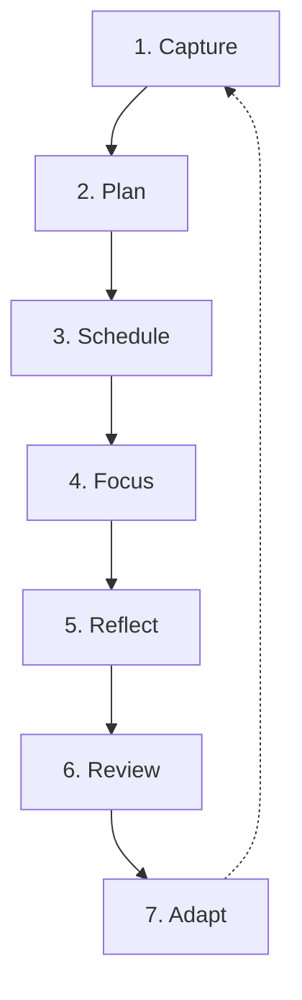

# Core Loop

Athena's behavioral engine is organized around a 7-stage lifecycle. Each stage transitions cleanly into the next, maintaining clear data ownership and state boundaries.

---

## The 7-Stage Lifecycle

### Stage 1: Capture
- **Location:** [[Planner]] (Inbox / Quick Capture), [[Today]].
- **Action:** Record unstructured tasks, thoughts, or upcoming commitments without immediate scheduling pressure.
- **Data Entity:** [[Tasks\|Task]] created with `status: "todo"` and optional `dueDate`.

### Stage 2: Plan
- **Location:** [[Planner]], [[Today]].
- **Action:** Decide *which day* a task will be tackled. Triage backlogs, set priorities (`low`, `medium`, `high`), and group tasks under [[Goals]].
- **Data Entity:** `Task.plannedDate` set to a target date.

### Stage 3: Schedule
- **Location:** [[Timeline]].
- **Action:** Allocate explicit clock intervals for the task on a calendar grid (e.g., 09:00–10:30).
- **Data Entity:** [[Timeline\|ScheduleBlock]] created with `startTime`, `endTime`, `durationMinutes`, and linked `taskId`.

### Stage 4: Focus
- **Location:** [[Focus]].
- **Action:** Work on the task in an isolated, distraction-minimized environment.
- **Runtime System:** Driven by the [[Focus Runtime]], which maintains wall-clock timing, segments (focus vs. break), pause events, and scratchpad [[Notes]].
- **Data Entity:** [[Sessions\|Session]] created with `status: "active"`.

### Stage 5: Reflect
- **Location:** [[Session Review]].
- **Action:** Directly following session termination (completed or discarded), the user records focus depth, mood rating, distraction triggers, and notes.
- **Data Entity:** `Session.sessionFeedback` populated; `Session.status` transitions to `"completed"`.

### Stage 6: Review
- **Location:** [[Today]], [[Streaks and Daily Stats]].
- **Action:** End-of-day evaluation of focus minutes, completed segments, and consistency metrics.
- **Data Entity:** [[Streaks and Daily Stats\|DailyStats]] record evaluated; streak incremented or preserved via freeze.

### Stage 7: Adapt (Future Horizon)
- **Location:** [[Insights]], [[AI Direction]].
- **Action:** Algorithmic adjustment of daily focus targets and scheduling recommendations based on rolling historical completion rates.

---

## State Transition Matrix

The table below traces how an item moves across systems:

| Stage | Primary Surface | Entity Touched | Key Fields Updated |
| :--- | :--- | :--- | :--- |
| **Capture** | Planner / Today | `Task` | `title`, `status="todo"` |
| **Plan** | Planner | `Task` | `plannedDate`, `priority`, `goal` |
| **Schedule** | Timeline | `ScheduleBlock` | `startTime`, `endTime`, `taskId` |
| **Focus** | Focus Workspace | `Session` | `startedAt`, `segments`, `pauseEvents` |
| **Reflect** | Session Review | `Session` | `status="completed"`, `sessionFeedback` |
| **Review** | Today / Streaks | `DailyStats`, `Streak` | `focusMinutes`, `state`, `currentStreak` |
| **Adapt** | Insights (Future) | `Streak` | `dailyTargetMinutes`, `lastTargetReason` |
