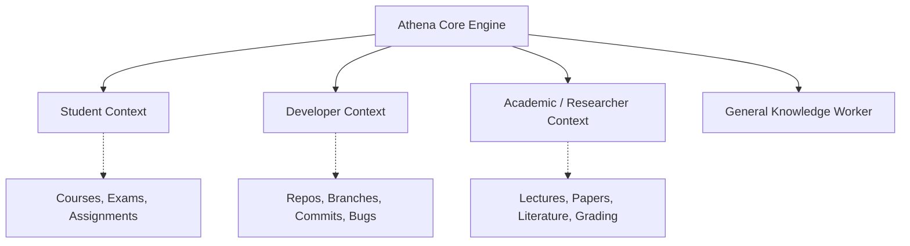

# Personas and Contexts

Athena is built around a single, highly disciplined productivity engine. Rather than fragmenting the product into separate apps for different professions, Athena uses **contextual metadata layers** on top of the shared core.

---

## The Common Core Engine

Every user—regardless of role—relies on the same underlying primitives:
- Capture & triage via [[Tasks]] and [[Planner]].
- Time allocation via [[Timeline]].
- Deep execution via [[Focus]] and [[Focus Runtime]].
- Reflection via [[Session Review]].
- Consistency tracking via [[Streaks and Daily Stats]].

---

## Contextual Personas (Exploratory / Future)

The following personas have been explored as domain-specific extensions to the core engine.

### 1. Student Context
- **Target Audience:** High school, undergraduate, and graduate students balancing course workloads.
- **Context Entities:**
  - `Course` / `Subject`: High-level category grouping tasks and notes.
  - `Assignment`: Task with strict submission deadlines and weightings.
  - `Exam Preparation Plan`: Milestone grouping study sessions leading up to an exam date.
  - `Revision Cycle`: Spaced repetition or scheduled review blocks on [[Timeline]].
- **Status:** `FUTURE / EXPLORATORY`.

### 2. Academic / Researcher Context
- **Target Audience:** Professors, PhD candidates, post-docs, and independent researchers.
- **Context Entities:**
  - `Research Project`: Long-horizon exploratory goal without linear daily tasks.
  - `Literature Review Workflow`: Paper reading notes linked to focus sessions.
  - `Lecture Planning & Grading`: Batch work sessions requiring deep focus intervals.
  - `Meeting Context`: Distinguishing student office hours from isolated research blocks.
- **Status:** `FUTURE / EXPLORATORY`.

### 3. Developer Context
- **Target Audience:** Software engineers, systems architects, and technical contributors.
- **Context Entities:**
  - `Repository / Workspace Link`: Associating a Task with a local directory or Git URL.
  - `Work Types`: Explicit labeling for `feature`, `bug`, `refactor`, `investigation`.
  - `Branch / PR Reference`: Tying focus sessions to pull requests.
  - `Distraction Isolation`: Integrated desktop focus environments that silence notifications during compilation or deep coding.
- **Status:** `FUTURE / EXPLORATORY`.

### 4. General Knowledge Worker
- **Target Audience:** Founders, product managers, writers, consultants.
- **Context Entities:**
  - Clean project tags, goal milestones, and client/stakeholder labels.
  - Default out-of-the-box configuration in the current Athena platform.

---

## Boundary Safeguards

To prevent feature creep and product dilution, Athena enforces strict architectural boundaries:
- **No Domain Silos:** A developer task and a student assignment must use the exact same `Task` schema, differentiated only by optional tags or contextual references.
- **No Embedded LMS / IDE:** Athena will not build code editors, terminal emulators, or grading rubrics. It remains an execution and behavioral awareness tool that sits alongside the user's primary work tools.
