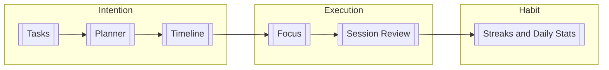

Athena is a behavior-aware task management and deep work execution platform. It treats productivity not merely as a transactional todo list or a passive countdown timer, but as a closed-loop behavioral feedback system.

---
## The Problem Space

Standard productivity tools typically bifurcate into two incomplete paradigms:
1. **Todo Trackers:** Focus exclusively on *what* needs to be done. They treat tasks as static text strings, ignoring how long work takes, when attention was allocated, or why tasks were rescheduled.
2. **Generic Timers / Pomodoro Apps:** Focus exclusively on *time spent*. They operate in total isolation from the user's task backlog, schedule, or psychological state during work.

When users struggle with productivity, the breakdown is rarely a lack of list-making; it stems from:
- **Planning Distortion:** Overestimating capacity and underestimating execution friction.
- **Attention Fragmentation:** Silent context switches and unaccounted distractions.
- **Loss of Motivation:** Ambiguous progress tracking and burnout from rigid, punitive streaks.
- **Lack of Behavioral Telemetry:** Inability to inspect past patterns (e.g., when focus peaks, which tasks trigger avoidance).

---

## What Athena Is

Athena unifies intention with execution across three coupled domains:
- **Intention (Planning):** Structured backlog prioritization and day allocation in [[Planner]] and [[Today]].
- **Time Allocation (Scheduling):** Dedicating explicit calendar blocks to tasks via [[Timeline]].
- **Execution (Focus):** Executing work within an isolated, drift-free workspace powered by the [[Focus Runtime]].
- **Reflection (Review):** Measuring subjective focus quality, mood, and objective interruptions via [[Session Review]].
- **Habit Reinforcement (Consistency):** Encouraging daily follow-through via [[Streaks and Daily Stats]].

---
## Domain Entity Boundaries

To maintain architectural clarity, Athena maintains strict conceptual boundaries:

| Concept | Entity | Semantic Meaning |
| :--- | :--- | :--- |
| **What** | [[Tasks\|Task]] | The unit of work to be completed. |
| **When** | [[Timeline\|ScheduleBlock]] | A planned window of time reserved for work. |
| **Actual Work** | [[Sessions\|Session]] | The recorded execution telemetry (time, pauses, notes). |
| **Planned Intention** | `Task.plannedDate` | The calendar day on which a task was intended to be executed. |
| **Consistency** | [[Streaks and Daily Stats\|Streak]] | Sustained follow-through on planned work over consecutive days. |

---
## Implementation vs. Future Horizon

Athena's architectural evolution is phased to ensure stability:

- **Current Implementation:** Full client-side route-persistent focus runtime, session lifecycle, day planning, task checklists, timeline scheduling, mood/focus rating capture, and focus-minutes streak calculation.
- **Locked Product Decisions:** Full separation of task completion from session completion, neutral rescheduling semantics, and day-outcome streak models (see [[Product Decisions]]).
- **Future Horizon:** Detailed analytics in [[History]], automated behavioral diagnosis in [[Insights]], and adaptive scheduling algorithms in [[AI Direction]].
