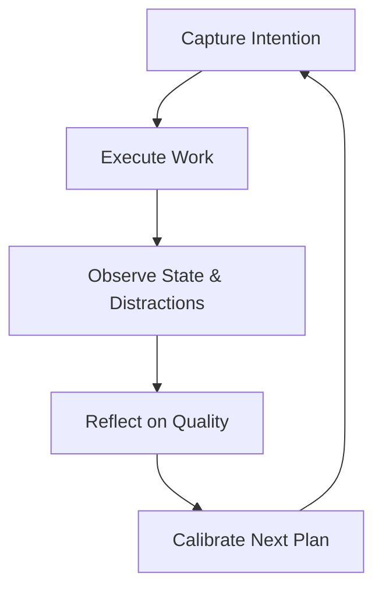

# Product Philosophy

Athena’s architectural and product design stems from three core psychological and systems-engineering principles.

---
## 1. Consistency Over Intensity

Human performance is governed by compounding daily habits rather than sporadic, heroic sprints that lead to burnout.

- **Non-Punitive Tracking:** A streak engine must distinguish between legitimate failure and adaptive pacing. Features such as streak freezes and partial achievement states prevent users from abandoning systems after a single interrupted day.
- **Pacing Awareness:** Encouraging achievable daily focus targets (e.g., 25–60 minutes of high-density focus) creates sustainable rhythms.
- **Separation of Duration and Success:** High hours do not correlate with high output if accompanied by fragmentation and cognitive fatigue. Athena prioritizes *clean execution* over inflated clock hours.

---
## 2. Awareness Drives Improvement

Productivity cannot be optimized without accurate observability. Most users suffer from cognitive biases:
- **Planning Fallacy:** Consistently assuming future tasks will proceed without friction.
- **Distraction Amnesia:** Forgetting the frequency and root causes of micro-interruptions (e.g., checking messages, noise, mind wandering).

By prompting users for concise, low-friction reflection at the close of every session in [[Session Review]], Athena collects the raw telemetry needed to illuminate behavioral bottlenecks:
- Quantified focus depth (1–5 scale).
- Subjective mood state (1–5 scale).
- Categorized distraction events (Phone, Messages, Noise, People, Web, Mind Wandering).

---
## 3. Feedback-Driven Execution Loop

Athena operates as a stateful cybernetic loop:

- **Objective Metrics:** Exact wall-clock duration, completed session segments, and pause counts.
- **Subjective Metrics:** Perceived focus depth and emotional friction.
- **Adaptive Calibration:** Telemetry informs subsequent daily targets, avoiding the perpetual overload cycle typical of static todo apps.

---
## 4. Architectural Honesty

A core engineering tenet of Athena is **zero synthetic data**:
- If a user pauses the timer, the timer must stop ticking; no simulated progress is recorded.
- If a user completes a focus session on a task, the task is **not** automatically marked completed unless the user explicitly confirms completion.
- If work was planned for Tuesday and unfinished by midnight, the system must not rewrite history by silently moving the creation or planning timestamp to Wednesday. Unfinished work must remain historically anchored to its original date of intent.
