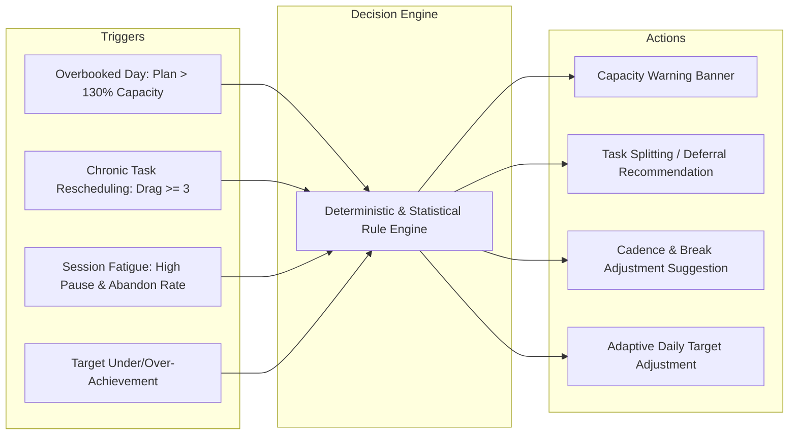

# Adaptive Intelligence Architecture — Phase 1 Specification

> **Status:** Specification / Architectural Blueprint  
> **Branch:** `feat/adaptive-ai-arch`  
> **Domain:** Behavioral Telemetry, Derived Signals, Deterministic & Statistical Adaptation  
> **Scope:** Definition of Athena's adaptive co-pilot system grounded strictly in real product data.  
> **Constraints:** No LLM, no machine learning models, no conversational chatbot, no gamification, no database migrations, no speculative telemetry in this phase.

---

## 1. Executive Summary & Foundational Principles

Athena's adaptive intelligence architecture is designed as an **observant, adaptive co-pilot** rather than an autonomous decision-maker or generative chatbot. The system's purpose is to protect the user from cognitive overload, assist in realistic workload planning, and support sustainable deep-work habits through **transparent, explainable, and user-overridable recommendations**.

### Core Tenets

1. **Grounded in Actual Telemetry:** Every adaptation must derive from verifiable, persisted behavioral data already captured by Athena's execution loop (Focus sessions, task occurrences, schedule blocks, daily stats, and user settings).
2. **Deterministic & Statistical First:** Machine learning and generative AI are explicitly rejected where deterministic logic, statistical rollups, or simple threshold heuristics provide greater transparency, predictability, and user trust.
3. **No Silent Mutation:** Athena will **never** silently alter user plans, reschedule commitments, change priorities, or delete tasks without explicit user approval.
4. **Transparent Provenance ("Show the Math"):** Every recommendation must explain *why* it was generated using user-visible behavioral facts (e.g., *"You have rescheduled this task 4 times across 3 days"* rather than opaque statements like *"AI detected low motivation"*).
5. **Non-Judgmental & Non-Diagnostic:** The system records and responds to behavioral actions, not psychological diagnoses. Terms like "ADHD", "laziness", "burnout syndrome", or "executive dysfunction" are strictly forbidden in product interfaces and code semantics.

---

## 2. Data Observability Audit: Three Categorical Boundaries

To prevent speculative features from corrupting system design, all data in Athena is partitioned into three strict categories:

```
┌────────────────────────────────────────────────────────────────────────┐
│                          1. DIRECTLY OBSERVED                          │
│        Persisted in database with cryptographic or wall-clock integrity │
└───────────────────────────────────┬────────────────────────────────────┘
                                    │
                                    ▼
┌────────────────────────────────────────────────────────────────────────┐
│                           2. DERIVED VALUES                            │
│  Mathematically computed from observed data (deterministic / verifiable)│
└───────────────────────────────────┬────────────────────────────────────┘
                                    │
                                    ▼
┌────────────────────────────────────────────────────────────────────────┐
│                        3. INFERRED HYPOTHESES                          │
│   Subjective interpretations & potential patterns (NEVER treated as fact)│
└────────────────────────────────────────────────────────────────────────┘
```

### 2.1. Directly Observed Data
Data explicitly captured and persisted by Athena's PostgreSQL schemas:

* **Execution Sessions (`sessions`):** `startedAt`, `endedAt`, `durationSeconds`, `plannedDurationSeconds`, `totalFocusMinutes`, `totalBreakMinutes`, `pauseCount`, `totalPauseDurationSeconds`, `interruptions`, `status` (`active`, `completed`), `completionType` (`completed`, `skipped`, `abandoned`), `sessionTaskOutcome` (`completed`, `partially_completed`, `not_completed`), snapshot schedule block bindings.
* **Session Segments (`session_segments`):** `segmentIndex`, `type` (`focus`, `break`), `durationSeconds`, `totalDurationSeconds`, `startedAt`, `completedAt`.
* **Pause Events (`session_pause_events`):** `clientPauseId`, `startTime`, `endTime`, `durationSeconds`, `reason`.
* **Subjective Session Reflection (`session_feedback`):** `moodRating` (1–5 integer), `focusRating` (1–5 integer), `distractionsNotes` (comma-separated tags / text).
* **Task Intentions (`tasks`):** `title`, `description`, `status` (`todo`, `in-progress`, `completed`, `cancelled`), `priority` (`low`, `medium`, `high`), `dueDate` (`YYYY-MM-DD`), `plannedProductDate` (`YYYY-MM-DD`), `orderIndex`, `tags`.
* **Day-Specific Commitments (`task_occurrences`):** `productDate` (`YYYY-MM-DD`), `outcome` (`pending`, `completed`, `partially_completed`, `rescheduled`, `missed`, `cancelled`), `rescheduledToDate`, `completedAt`, snapshot title & priority.
* **Calendar Allocations (`schedule_blocks`):** `productDate`, `startTime`, `endTime`, `durationMinutes`, `status` (`scheduled`, `completed`, `skipped`), `taskId`, `sessionId`.
* **Historical Daily Aggregations (`daily_stats`):** `productDate`, `focusMinutes`, `sessionCount`, `totalPlanned`, `effectivePlanned`, `tasksCompleted`, `tasksPartiallyCompleted`, `tasksRescheduled`, `tasksMissed`, `tasksCancelled`, `dailyTargetMinutes`, `completionRate`, `state` (`green`, `yellow`, `red`, `neutral`), `resultType` (`success`, `partial`, `failed`, `neutral`, `freeze_saved`), `streakCount`, `usedFreeze`.
* **Longitudinal Consistency (`streaks`):** `currentStreak`, `longestStreak`, `lastActiveDate`, `freezeBalance`, `totalFreezesUsed`, `dailyTargetMinutes`, `minTargetMinutes`, `maxTargetMinutes`, `lastTargetReason`.
* **User Configuration (`users`):** `timezone`, `breakDurationSeconds`, `autoStartBreaks`, `breaksNumber`, `soundEnabled`, `skipBreaks`, `confirmReset`.

### 2.2. Derived Values
Computed deterministically from directly observed data:

* **Weighted Completion Rate:** $\frac{\text{completed} \times 1.0 + \text{partially\_completed} \times 0.5}{\text{totalPlanned} - \text{rescheduled} - \text{cancelled}}$
* **Task Reschedule Velocity:** Cumulative count of historical occurrences where `outcome = 'rescheduled'` for a specific task ID.
* **Cumulative Focus Invested Per Task:** Sum of `durationSeconds` across all `sessions` linked via `session_tasks` for a specific task ID.
* **Schedule Start Adherence (Latency):** $\Delta t = \text{Session.startedAt} - \text{ScheduleBlock.startTime}$.
* **Focus Segment Ratio:** $\frac{\text{focusSegmentsCompleted}}{\text{totalFocusSegmentsPlanned}}$.
* **Rolling Historical Daily Capacity:** 14-day median of `daily_stats.focusMinutes` on non-neutral days.
* **Daily Plan Load vs. Capacity Ratio:** $\frac{\sum \text{ScheduleBlock.durationMinutes}}{\text{14-day median focusMinutes}}$.

### 2.3. Inferred Hypotheses (Must NOT be treated as facts)
Subjective interpretations that require user confirmation:

* *"User is avoiding Task X"* (inferred from high reschedule count + zero focus time).
* *"Task X is too large or ambiguously defined"* (inferred from repeated partial sessions or high pause rates).
* *"User's optimal cognitive focus window is Morning"* (inferred from statistical cluster of high `focusRating` sessions).
* *"User is at risk of burnout"* (inferred from consecutive red days, high freeze consumption, or falling session durations).

---

## 3. Behavioral Signal Inventory

| Signal Name | Source Table | Granularity | Temporal Scope | Reliability | Missing-Data Risk | Confounders | User Visible | Safe for Adaptation |
| :--- | :--- | :--- | :--- | :--- | :--- | :--- | :--- | :--- |
| **Actual Focus Duration** | `sessions.durationSeconds` | Per-session | Immediate | **High** (Wall-clock monotonic) | Low (checkpointed periodically) | Browser sleep/hibernation (handled by RAF/wall-clock diff) | Yes | **Yes** |
| **Session Completion Type** | `sessions.completionType` | Per-session | Immediate | **High** (`completed`, `skipped`, `abandoned`) | Low | User stopping early because task finished fast | Yes | **Yes** |
| **Pause Frequency & Duration** | `sessions.pauseCount`, `totalPauseDurationSeconds` | Per-session | Immediate | **High** (Timestamped pause events) | Medium (quick micro-pauses < 5s) | Phone calls, urgent real-world interrupts | Yes | **Yes** |
| **Logged Distractions** | `session_feedback.distractionsNotes` | Per-session | Post-session | **Medium** (Self-reported) | High (user may skip typing/selecting) | Social desirability bias | Yes | **Conditional** (informational only) |
| **Subjective Ratings** | `session_feedback.moodRating`, `focusRating` | Per-session | Post-session | **Medium** (1–5 ordinal scale) | High (optional feedback modal) | Mood influenced by external non-work factors | Yes | **Conditional** (never sole trigger) |
| **Task Occurrence Outcome** | `task_occurrences.outcome` | Per-day/task | End-of-day / Live | **High** (Enforced database state) | Low | User completed work offline without checking off | Yes | **Yes** |
| **Task Rescheduling Frequency** | `task_occurrences` history | Per-task | Longitudinal | **High** (Immutable audit trail) | Low | External blockers, waiting on third party | Yes | **Yes** |
| **Schedule Block Start Latency** | `schedule_blocks` vs `sessions` | Per-block | Point-in-time | **Medium** (Requires linked `scheduleBlockId`) | High (unlinked quick sessions have no schedule block) | Meetings running late, external schedule changes | Yes | **Yes** |
| **Daily Focus Total** | `daily_stats.focusMinutes` | Per-day | Daily | **High** (Accumulated from sessions) | Low | Unrecorded offline work | Yes | **Yes** |
| **Daily Target Adherence** | `daily_stats.state`, `resultType` | Per-day | Daily | **High** (Evaluated by daily outcome engine) | Low | Goalpost shifted mid-day | Yes | **Yes** |
| **Streak Continuity & Freezes** | `streaks.currentStreak`, `freezeBalance` | Per-user | Longitudinal | **High** (Strict evaluation engine) | Low | Rest days counted as missed if not planned | Yes | **Yes** |

---

## 4. Derived Feature Definitions

### 4.1. Rolling Effective Focus Capacity ($C_{14}$)
* **Formula:** $\text{Median}(\{ \text{daily\_stats.focusMinutes} \mid \text{state} \neq \text{'neutral'}, \text{days} \in [-14, -1] \})$
* **Required Data:** `daily_stats` (minimum 5 non-neutral days in 14-day window).
* **Stability:** High (median dampens single-day outliers).
* **Confidence Threshold:** High if $\ge 7$ active days; Medium if $5–6$ active days; Low/Insufficient if $< 5$ active days.
* **Storage Strategy:** Calculated on-demand or cached during morning dashboard bootstrap. Not persisted in DB schema.

### 4.2. Task Rescheduling Drag ($D_{\text{task}}$)
* **Formula:** $\sum_{i=1}^{N} \mathbb{I}(\text{task\_occurrences.outcome} = \text{'rescheduled'} \land \text{taskId} = T)$
* **Required Data:** `task_occurrences` for task $T$.
* **Stability:** Strictly monotonic non-decreasing per task.
* **Confidence Threshold:** High (exact database count).
* **Storage Strategy:** Calculated on-demand when inspecting a task or rendering backlog cards.

### 4.3. Task Execution Investment Ratio ($R_{\text{invest}}$)
* **Formula:** $\frac{\sum \text{durationSeconds for task } T}{\text{plannedDurationSeconds for task } T}$
* **Required Data:** `session_tasks` joined with `sessions`, and `tasks.plannedProductDate`.
* **Stability:** Monotonic non-decreasing.
* **Confidence Threshold:** High if focus sessions were linked to the task.
* **Storage Strategy:** Computed on-demand.

### 4.4. Planning Overload Factor ($O_{\text{day}}$)
* **Formula:** $\frac{\sum_{b \in \text{Blocks}_{\text{day}}} b.\text{durationMinutes}}{C_{14}}$
* **Required Data:** `schedule_blocks` for target product date + $C_{14}$.
* **Stability:** Fluctuates as user adds/removes schedule blocks.
* **Confidence Threshold:** High when $C_{14}$ has $\ge 7$ days of history.
* **Storage Strategy:** Volatile client-side/planner evaluation.

### 4.5. Diurnal Focus Density Distribution ($P_{\text{window}}$)
* **Formula:** Proportion of completed focus minutes occurring in 4 discrete 6-hour buckets:
  * Morning (06:00–12:00 local)
  * Afternoon (12:00–18:00 local)
  * Evening (18:00–24:00 local)
  * Night (00:00–06:00 local)
* **Required Data:** `sessions.startedAt` + `user.timezone` over past 30 days.
* **Stability:** Moderate (reflects routine shifts).
* **Confidence Threshold:** Requires $\ge 10$ sessions across $\ge 7$ distinct days.
* **Storage Strategy:** Cached per user, recomputed weekly.

---

## 5. Adaptation Opportunity Matrix & Decisions



### Adaptation 1: Day Overload Capacity Warning
* **Trigger:** $\sum \text{ScheduleBlock.durationMinutes} > 1.30 \times C_{14}$ (Total scheduled work exceeds 130% of user's 14-day median capacity).
* **Minimum Confidence:** $\ge 7$ active days in past 14 days.
* **Decision Logic:** Deterministic inequality check.
* **User-Visible Explanation:** *"You have scheduled 5h 30m of focus work today. Over the past two weeks, your median completed focus time was 3h 45m. Consider deferring lower-priority items to avoid end-of-day burnout."*
* **User Override:** Prominent "Keep Schedule" dismiss button. Dismissal persists for the rest of that product day.
* **Low Confidence Fallback:** If $< 7$ days of data, suppress warning completely (do not warn new users before baseline is established).

### Adaptation 2: Task Avoidance & Deferral / Split Suggestion
* **Trigger:** $D_{\text{task}} \ge 3$ (Task rescheduled $\ge 3$ times) AND $\text{totalFocusMinutes} < 10$ (less than 10 minutes of active focus ever spent on it).
* **Minimum Confidence:** Absolute (deterministic count).
* **Decision Logic:** Exact threshold match.
* **User-Visible Explanation:** *"This task has been rescheduled 4 times without focus time recorded. Would you like to break it into smaller sub-tasks or move it to your Backlog for later review?"*
* **User Override:** "Keep in Today" / "Remind me in 3 days".
* **Low Confidence Fallback:** Does not fire for tasks rescheduled $< 3$ times.

### Adaptation 3: Task Splitting Recommendation for Fragmented Execution
* **Trigger:** Task has $\ge 3$ sessions marked `partially_completed` OR $> 6$ pause events logged across sessions without completion.
* **Minimum Confidence:** $\ge 3$ distinct linked sessions.
* **Decision Logic:** Count of partial outcomes $\ge 3$.
* **User-Visible Explanation:** *"You've completed 3 focus sessions on this task with partial progress. Large tasks are often easier to finish when broken into 2–3 discrete steps."*
* **User Override:** One-click "Dismiss".
* **Low Confidence Fallback:** Suppress until 3 sessions have accumulated.

### Adaptation 4: Dynamic Daily Focus Target Adjustment
* **Trigger:** Consistency analysis over past 7 product days (leveraging `backend/utils/adaptiveTarget.js` model):
  * **Increase:** Past 5 active days have $\ge 100\%$ target achievement, zero freezes consumed, and current target $< \text{maxTargetMinutes}$.
  * **Decrease:** $\ge 2$ Red days OR $\ge 2$ freezes used in past 7 days, and current target $> \text{minTargetMinutes}$.
* **Minimum Confidence:** $\ge 5$ evaluated days in the 7-day window.
* **Decision Logic:** Bounded step adjustment ($\pm 5$ minutes, bounded within $[\text{minTargetMinutes}, \text{maxTargetMinutes}]$).
* **User-Visible Explanation:** 
  * *Scale up:* *"You've comfortably reached your focus target for 5 consecutive days. Adjusting daily target from 25m to 30m to build stamina."*
  * *Scale down:* *"You've had a demanding week with multiple freezes used. Dialing daily target from 45m to 40m to help maintain your streak sustainably."*
* **User Override:** Immediate undo toast with "Revert Target" button, plus manual override anytime in Settings.
* **Low Confidence Fallback:** Target remains strictly frozen at previous value (`lastTargetReason = 'no_change'`).

---

## 6. Algorithmic Classification: Deterministic vs. Statistical vs. ML vs. LLM

To preserve system speed, code simplicity, and debuggability, every proposed capability is categorized into the simplest viable engineering discipline:

| Capability | Rule-Based | Statistical | ML | LLM | Justification & Architectural Boundary |
| :--- | :---: | :---: | :---: | :---: | :--- |
| **Capacity Overload Warning** | | **✓** | | | **Pure Statistical:** Median computation over a sliding 14-day window compared against a linear threshold. An ML model or LLM adds latency and unpredictability without improving accuracy. |
| **Reschedule Drag Detection** | **✓** | | | | **Pure Rule-Based:** Integer counter check ($D_{\text{task}} \ge 3$). Exact, instantaneous, zero cost. |
| **Target Scale Up/Down** | | **✓** | | | **Statistical Heuristic:** Simple state counting over 7 days with step boundaries ($\pm 5\text{m}$). Solved by deterministic arithmetic. |
| **Optimal Focus Window Suggestion** | | **✓** | | | **Descriptive Statistics:** Histogram bucket analysis across 30 days. Finding the modal hour bucket does not require machine learning. |
| **Task Splitting Breakdown Assistance** | | | | **✓ (Deferred)** | **Language Modeling (Future):** While *detecting* that a task needs splitting is 100% deterministic, *generating* 3 meaningful subtask titles from a vague task description (e.g. "Write Research Paper") is a natural language task. **Deferred to Phase 3.** |
| **Predictive Fatigue Modeling** | | | **✓ (Deferred)** | | **Machine Learning (Future):** Predicting exact within-session abandonment probability using multi-variate telemetry (time-of-day, past pause intervals, elapsed minutes). **Deferred until large dataset exists.** |

> **Architectural Law:** Never deploy a complex statistical model when a threshold rule works; never deploy an ML model when summary statistics suffice; never deploy an LLM when structured code can compute the answer.

---

## 7. Proposed Adaptive Intelligence Architecture

The architecture consists of **6 decoupled layers** with strict unidirectional data flow:

```
┌────────────────────────────────────────────────────────────────────────┐
│                      LAYER 1: BEHAVIORAL TELEMETRY                     │
│    PostgreSQL Tables: sessions, session_segments, task_occurrences,    │
│            schedule_blocks, daily_stats, streaks, session_feedback     │
└───────────────────────────────────┬────────────────────────────────────┘
                                    │ (Read-only query aggregation)
                                    ▼
┌────────────────────────────────────────────────────────────────────────┐
│                   LAYER 2: FEATURE COMPUTATION LAYER                   │
│   Calculates rolling metrics: C_14, RescheduleDrag, InvestmentRatio,   │
│             PlanningLoadFactor, DiurnalDensityDistribution             │
└───────────────────────────────────┬────────────────────────────────────┘
                                    │ (Normalized feature vectors)
                                    ▼
┌────────────────────────────────────────────────────────────────────────┐
│                LAYER 3: USER CONTEXT & SAFETY BOUNDARY                 │
│  Resolves: User timezone, active settings, minimum data confidence,    │
│                 suppression cooldowns, user opt-outs                   │
└───────────────────────────────────┬────────────────────────────────────┘
                                    │ (Validated context + features)
                                    ▼
┌────────────────────────────────────────────────────────────────────────┐
│                  LAYER 4: ADAPTATION DECISION ENGINE                   │
│    Pure deterministic rule evaluators & statistical threshold checks   │
│          Outputs: Structured AdaptationIntent objects (not UI)         │
└───────────────────────────────────┬────────────────────────────────────┘
                                    │ (AdaptationIntent: type, payload, why)
                                    ▼
┌────────────────────────────────────────────────────────────────────────┐
│                 LAYER 5: EXPLAINABLE PROJECTION LAYER                  │
│       Formats human-readable explanation, behavioral evidence,         │
│                        and explicit override actions                   │
└───────────────────────────────────┬────────────────────────────────────┘
                                    │ (REST API / Reducer state)
                                    ▼
┌────────────────────────────────────────────────────────────────────────┐
│                     LAYER 6: PRODUCT PRESENTATION                      │
│     - Today: Capacity warning banner, dynamic target dial              │
│     - Planner: Workload overload indicator, task split badges          │
│     - Task Inspector: Avoidance diagnostic badge ("Rescheduled 4x")    │
└────────────────────────────────────────────────────────────────────────┘
```

### Layer Responsibilities

1. **Layer 1 (Telemetry):** System of record. No business logic.
2. **Layer 2 (Feature Computation):** Pure mathematical functions (e.g. `computeRollingCapacity(dailyStats, 14)`). Fully testable with unit tests.
3. **Layer 3 (Safety Boundary):** Enforces prerequisites. If user has $< 7$ days of history, it short-circuits feature evaluation to prevent low-confidence noise.
4. **Layer 4 (Decision Engine):** Evaluates inputs against rule thresholds. Emits structured intents:
   ```json
   {
     "adaptationType": "PLANNING_OVERLOAD_WARNING",
     "severity": "advisory",
     "metrics": {
       "scheduledMinutes": 330,
       "rollingCapacityMinutes": 225,
       "overloadRatio": 1.46
     },
     "confidence": 0.92
   }
   ```
5. **Layer 5 (Projection):** Formats clear English descriptions referencing the exact numbers. Attach undo/override endpoints.
6. **Layer 6 (Presentation):** Renders unobtrusive UI badges or dismissible callouts in the appropriate feature surfaces.

---

## 8. Missing Data & Instrumentation Gaps

Before subsequent phases can expand adaptive capabilities, the following specific telemetry gaps exist in Athena today:

| Missing Telemetry | Why It Is Needed | Can Existing Data Approximate It? | Worth Instrumenting in Future? | Recommended Future Instrumentation |
| :--- | :--- | :--- | :--- | :--- |
| **Task Estimation ($T_{\text{est}}$)** | To compare estimated vs actual task duration. | No. Currently tasks have no estimated duration field; only `schedule_blocks` have duration. | **High Value** | Add optional `estimatedMinutes` field to `Task` entity in future schema milestone. |
| **Offline Context Switches** | Measuring how often user switches active application windows during focus. | No. Desktop runtime only detects manual pause events. | **Low Value** (Privacy Risk) | Reject. OS-level window snooping violates Athena's privacy-first posture. |
| **Granular Task Creation Origin** | Knowing if task was created from Planner, Today quick-add, or converted from a Note. | Partially (inferred from timestamp and initial date). | **Low Value** | Not critical for MVP adaptation. |
| **Explicit Rest/Vacation Mode** | Differentiating intentional rest days from forgotten or abandoned days. | Partially (currently handled by consuming Freeze tokens). | **High Value** | Add planned rest day toggle so streaks are paused without consuming emergency freezes. |

---

## 9. AI Safety, Ethics & Trust Boundaries

Athena's adaptive co-pilot must adhere to strict ethical and operational boundaries:

### What Athena Will NEVER Do
1. **No Silent Mutations:** Never automatically move a task to another day, change its priority, or alter its status without a confirmation click.
2. **No Diagnostic or Psychiatric Claims:** Never label user behavior with clinical terminology (e.g. "ADHD paralysis", "executive failure", "dopamine crash"). Recommendations must describe observable events (e.g. *"This task has been postponed 4 times"*).
3. **No Fake Urgency or Shaming:** Never use manipulative notifications, guilt-inducing copy (e.g. *"You're failing your goals"*), or artificial streaks.
4. **No Irreversible Actions:** Every automated suggestion must provide a single-click **Undo** or direct override in user preferences.
5. **No Hallucinated Tasks:** Never autonomously generate tasks into the user's personal backlog.

---

## 10. Initial MVP Scope: Phase 1 Implementation Targets

The MVP adaptive implementation will focus exclusively on **3 high-confidence, low-complexity capabilities**:

```
┌───────────────────────────────────────────────────────────────────────────┐
│                           INITIAL MVP SCOPE                               │
├─────────────────────────────────────┬─────────────────────────────────────┤
│ 1. Dynamic Daily Focus Target       │ Auto-steps daily goal +/- 5m based  │
│                                     │ on 7-day consistency and freezes.   │
├─────────────────────────────────────┼─────────────────────────────────────┤
│ 2. Planner Capacity Overload Alert  │ Advisory warning when scheduled day │
│                                     │ exceeds 130% of 14-day capacity.    │
├─────────────────────────────────────┼─────────────────────────────────────┤
│ 3. Task Avoidance Drag Diagnostic   │ Subtle badge in Task Inspector for  │
│                                     │ tasks rescheduled >= 3 times.       │
└─────────────────────────────────────┴─────────────────────────────────────┘
```

### Rationale for MVP Selection
* **Zero New Database Fields:** All 3 capabilities execute directly on existing PostgreSQL data in `daily_stats`, `streaks`, `task_occurrences`, and `schedule_blocks`.
* **Zero External Dependencies:** 100% computed via pure in-memory JavaScript math functions.
* **100% Explainable:** Each capability can be verified by the user by reviewing their own History calendar.

---

## 11. Explicitly Deferred Capabilities

The following capabilities are recognized as valuable long-term concepts but are **strictly deferred** from Phase 1:

1. **LLM Task Decomposition:** Generating subtasks using a generative model. *Deferred until prompt safety, latency boundaries, and user opt-in infrastructure are established.*
2. **Predictive Session Failure Model:** Machine learning model to predict mid-session abandonment based on pause patterns. *Deferred until dataset contains $> 10,000$ validated sessions.*
3. **Automatic Smart Schedule Block Placement:** Constraint-satisfaction solver to auto-tile the user's day. *Deferred because manual time-blocking is a foundational cognitive habit in Athena's philosophy.*
4. **Natural Language Weekly Executive Summary:** LLM-generated reflection report. *Deferred to Phase 3.*

---

## 12. Verification & Architectural Invariants

* **Schema Independence:** This architecture introduces zero schema migrations and zero breaking API changes.
* **Testing Strategy for Future Implementation:**
  * Feature layer must be covered by deterministic unit tests verifying edge cases (0 active days, 1 active day, leap days, timezone crossing).
  * Decision engine must be covered by tabular truth-table tests asserting exact output intents for simulated inputs.
* **User Control Guarantee:** Every adaptive feature must include an explicit toggle in `Settings -> Focus` allowing complete opt-out.
