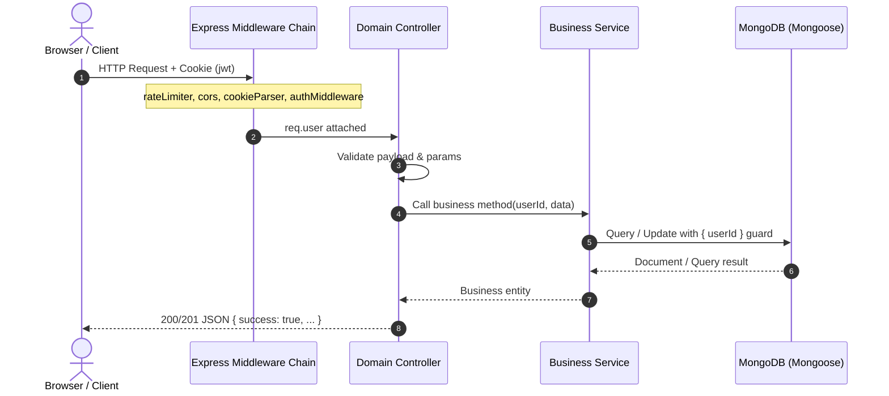

# Backend Architecture

Athena’s backend is an Express-based Node.js service adhering to a layered architectural pattern:

$$\text{Route} \longrightarrow \text{Middleware} \longrightarrow \text{Controller} \longrightarrow \text{Service} \longrightarrow \text{Model / Persistence}$$

---

## The Request Lifecycle



---

## Layer Definitions & Invariants

### 1. Routes (`backend/routes/`)
- Declares HTTP verbs (`GET`, `POST`, `PATCH`, `DELETE`) and URL patterns.
- Attaches endpoint-specific rate limiters (`authLimiter`, `apiLimiter`, `heavyLimiter`).
- Attaches route guards (`authMiddleware`, `roleMiddleware`).
- **Invariant:** Routes contain **zero business logic**; they delegate directly to controllers.

### 2. Middleware (`backend/middlewares/`)
- **`authMiddleware.js`:** Extracts and verifies JWT from cookies or `Authorization: Bearer` headers. Validates user existence and attaches `req.user` (`_id`, `email`, `role`).
- **`roleMiddleware.js`:** Restricts administrative endpoints to `role: "admin"`.
- **`validationMiddleware.js`:** Sanitizes input strings and guards against prototype injection.

### 3. Controllers (`backend/controllers/`)
- Extracts parameters from `req.params`, `req.query`, and `req.body`.
- Performs HTTP status code translation (200, 201, 400, 403, 404, 500).
- Catches errors and shapes standard JSON response envelopes:
  ```json
  { "success": true, "session": { ... } }
  { "success": false, "message": "Error description" }
  ```
- **Invariant:** Controllers do not interact with Mongoose models directly; they must invoke Services.

### 4. Services (`backend/services/`)
- Encapsulates all domain business logic, invariants, and multi-document workflows.
- Examples:
  - `sessionService.js`: Session initialization, segment transitions, pause accounting, active session recovery.
  - `streakService.js`: Daily streak calculation, freeze deductions, target adaptations.
  - `taskService.js`: Task ordering, status mutations, date updates.
- **Invariant:** Every database query in a service must include `{ userId }` or `{ user: userId }` to guarantee multi-tenant tenant isolation.

### 5. Models (`backend/models/`)
- Mongoose schema definitions enforcing types, defaults, validations, and compound indexes.
- Encapsulates schema-level hooks (e.g. `pre("save")` password hashing in `userModel.js`).

---

## Architectural Exceptions

Where standard patterns were deviated from due to specific domain constraints:

1. **`plannerController.js` Aggregation:**
   - Aggregates tasks, notes, goals, and schedule blocks into a single consolidated payload for fast Planner hydration. Rather than calling multiple individual services, it coordinates queries directly within `plannerService` / `plannerController`.
2. **`sessionController.js` Streak Hook:**
   - When a session completes (`updateSession`), the controller synchronously invokes `StreakService.dailyStreakUpdate` and `StreakService.processDailyStreak` to immediately calculate updated streak status.
