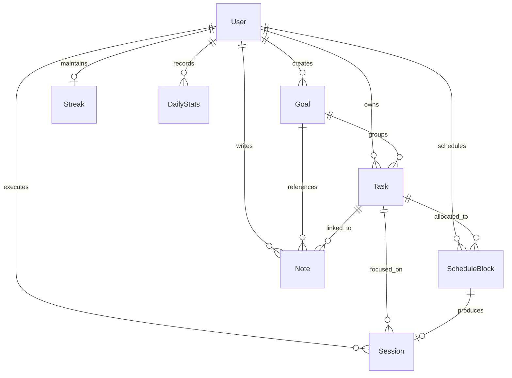

# Data Model

Athena uses MongoDB via Mongoose. Every document stored in the database is scoped to an individual user account.

---

## Entity Relationship Diagram

---

## 1. User (`backend/models/userModel.js`)

Primary account identity and profile record.

| Field | Type | Attributes | Description |
| :--- | :--- | :--- | :--- |
| `username` | String | required, unique, trim, min 3, max 20 | User handle. |
| `usernameLower` | String | required, unique, trim, lowercase | Case-insensitive handle lookup. |
| `email` | String | required, unique, trim, lowercase | User login email. |
| `password` | String | required, min 8 | Bcrypt-hashed password (cost 12). |
| `fullName` | String | required, trim, min 2, max 50 | Display name. |
| `type` | String | default: "user", enum: ["user", "admin"] | Role-based authorization tier. |
| `isEmailVerified`| Boolean | default: false | Registration verification flag. |
| `emailVerificationOTP` | String | - | 6-digit verification code. |
| `emailVerificationExpires` | Date | - | Verification code expiration. |
| `passwordResetOTP` | String | - | Reset code. |
| `passwordResetExpires` | Date | - | Reset code expiration. |
| `settings.theme` | String | default: "dark" | Active visual theme token. |
| `settings.session` | Object | subdocument | User-level default focus & break durations. |

---

## 2. Task (`backend/models/taskModel.js`)

Core unit of planned and actionable work.

| Field | Type | Attributes | Description |
| :--- | :--- | :--- | :--- |
| `user` | ObjectId | ref: "User", required, indexed | Owning user. |
| `goal` | ObjectId | ref: "Goal", default: null, indexed | Parent goal container. |
| `title` | String | required, trim, max 200 | Task description. |
| `description` | String | default: "" | Rich task notes/specifications. |
| `status` | String | enum: `["todo", "in-progress", "completed", "cancelled"]`, default: "todo" | Current lifecycle status. |
| `priority` | String | enum: `["low", "medium", "high"]`, default: "medium" | Triage importance. |
| `order` | Number | default: 0 | Manual sort order in lists. |
| `dueDate` | Date | optional | Hard external deadline. |
| `plannedDate`| Date | optional | Calendar date of intended execution. |
| `tags` | [String]| default: [] | Categorization tags. |

---

## 3. Session (`backend/models/sessionModel.js`)

The authoritative record of deep work execution.

| Field | Type | Attributes | Description |
| :--- | :--- | :--- | :--- |
| `sessionId` | String | required, indexed | Client-generated UUID string. |
| `userId` | ObjectId | ref: "User", required | Owning user. |
| `scheduleBlockId`| ObjectId | ref: "ScheduleBlock", default: null | Linked calendar block. |
| `taskIds` | [ObjectId] | ref: "Task", default: [] | Tasks addressed during this session. |
| `title` | String | required, trim | Session headline. |
| `sessionType` | String | enum: `["task", "quick"]`, default: "quick" | Focus trigger type. |
| `status` | String | enum: `["active", "completed"]`, default: "active" | Session state. |
| `completionType` | String | enum: `["completed", "skipped", "abandoned"]`, default: null | Termination classification. |
| `plannedDuration` | Number | default: 0 | Target focus duration in seconds. |
| `duration` | Number | default: 0 | Total elapsed focus time in seconds. |
| `startedAt` | Date | - | Initial session start timestamp. |
| `endedAt` | Date | - | Termination timestamp. |
| `sessionSegments` | [Segment] | subdocument array | Sequence of focus and break intervals. |
| `pauseEvents` | [Pause] | subdocument array | Audit log of pauses with reasons & durations. |
| `sessionStats` | Object | subdocument | Interruptions, pauses, completed segment counts. |
| `sessionFeedback`| Object | subdocument | Mood (1-5), focus (1-5), distractions, notes. |
| `todos` | [Todo] | subdocument array | Session-scoped execution checklist. |

---

## 4. ScheduleBlock (`backend/models/scheduleBlockModel.js`)

Allocated calendar time intervals on [[Timeline]].

| Field | Type | Attributes | Description |
| :--- | :--- | :--- | :--- |
| `userId` | ObjectId | ref: "User", required, indexed | Owning user. |
| `taskId` | ObjectId | ref: "Task", required, indexed | Allocated task. |
| `date` | Date | required, indexed | Calendar day. |
| `startTime` | Date | required | Clock interval start timestamp. |
| `endTime` | Date | required | Clock interval end timestamp. |
| `durationMinutes` | Number | required, min: 1 | Length of allocated block. |
| `status` | String | enum: `["scheduled", "completed", "skipped"]`, default: "scheduled" | Execution status. |
| `sessionId` | ObjectId | ref: "Session", default: null, indexed | Linked focus execution record. |

---

## 5. Streak (`backend/models/streakModel.js`)

Consistency counters and freeze bank.

| Field | Type | Attributes | Description |
| :--- | :--- | :--- | :--- |
| `userId` | ObjectId | ref: "User", unique, required | Owning user. |
| `currentStreak` | Number | default: 0 | Consecutive days achieved. |
| `longestStreak` | Number | default: 0 | All-time highest streak count. |
| `lastActiveDate` | Date | - | Last day user completed work. |
| `freezeBalance` | Number | default: 3 | Unused streak freeze tokens. |
| `totalFreezesUsed` | Number | default: 0 | Lifetime freeze consumption. |
| `maxFreezeBalance` | Number | default: 3 | Ceiling on freeze accumulation. |
| `dailyTargetMinutes`| Number| default: 25 | Daily threshold required for green day. |
| `lastProcessedDate`| Date | - | UTC day boundary last processed. |
| `lastCountedDate` | Date | - | UTC day boundary last incremented. |

---

## 6. DailyStats (`backend/models/dailyStatsModel.js`)

Daily aggregated productivity and streak evaluation record.

| Field | Type | Attributes | Description |
| :--- | :--- | :--- | :--- |
| `userId` | ObjectId | ref: "User", required, indexed | Owning user. |
| `date` | Date | required | UTC start-of-day boundary. |
| `focusMinutes` | Number | default: 0 | Sum of focus seconds / 60. |
| `sessions` | Number | default: 0 | Number of completed sessions. |
| `tasksCompleted`| Number | default: 0 | *Unpopulated (Known limitation)*. |
| `dailyTargetMinutes`| Number| required | Target in effect for this day. |
| `streakRate` | Number | required | `focusMinutes / dailyTargetMinutes`. |
| `state` | String | enum: `["green", "yellow", "red"]` | Visual health bucket. |
| `resultType` | String | enum: `["success", "partial", "failed", "freeze_saved"]` | Outcome classification. |
| `streakCount` | Number | required | Streak count active at end of day. |
| `usedFreeze` | Number | default: 0 | Flag indicating if freeze saved the streak. |

---

## 7. Goal (`backend/models/goalModel.js`)

Strategic milestones and categories.

| Field | Type | Attributes | Description |
| :--- | :--- | :--- | :--- |
| `user` | ObjectId | ref: "User", required, indexed | Owning user. |
| `title` | String | required, trim, max 100 | Goal title. |
| `description` | String | default: "" | Detailed objectives. |
| `color` | String | default: "#6366f1" | Hex display color. |
| `targetDate` | Date | optional | Target completion milestone. |
| `status` | String | enum: `["active", "completed", "archived"]`, default: "active" | Status lifecycle. |

---

## 8. Note (`backend/models/notesModel.js`)

Scratchpad, reflection, and task-linked knowledge capture.

| Field | Type | Attributes | Description |
| :--- | :--- | :--- | :--- |
| `user` | ObjectId | ref: "User", required, indexed | Owning user. |
| `title` | String | default: "", max 200 | Note headline. |
| `content` | String | required | TipTap HTML/rich-text content. |
| `goal` | ObjectId | ref: "Goal", default: null | Linked goal container. |
| `task` | ObjectId | ref: "Task", default: null | Linked task context. |
| `pinned` | Boolean | default: false | Top-of-list pin flag. |
| `tags` | [String] | default: [] | Categorization tags. |
