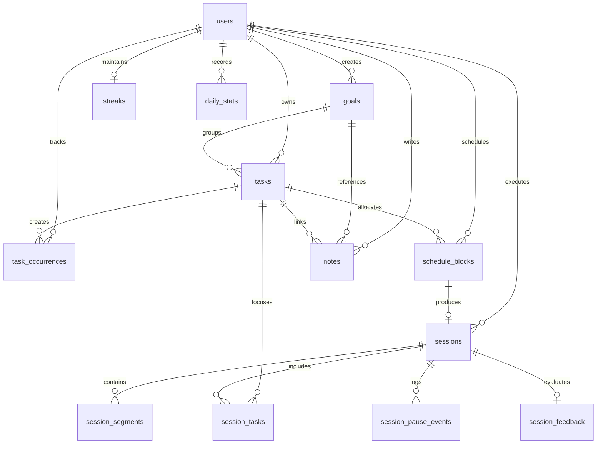

# Data Model

Athena utilizes a relational database architecture on **PostgreSQL (15+)** managed through **Drizzle ORM** (`backend/db/schema/`). Every entity is strictly scoped to an individual user via foreign key relationships (`userId`), enforcing multi-tenant isolation.

---

## Entity Relationship Diagram

---

## 1. User (`backend/db/schema/users.js`)

Primary account identity, preferences, and session defaults.

| Column | Type | Constraints / Attributes | Description |
| :--- | :--- | :--- | :--- |
| `id` | UUID | Primary Key, `defaultRandom()` | User identifier. |
| `username` | VARCHAR(20) | Not Null, Unique | User handle. |
| `username_lower` | VARCHAR(20) | Not Null, Unique | Case-insensitive lookup. |
| `email` | VARCHAR(255) | Not Null, Unique | Login email. |
| `password_hash` | VARCHAR(255) | Not Null | Bcrypt hash. |
| `account_type` | VARCHAR(20) | Default: `"user"` | Role: `"user"`, `"admin"`. |
| `full_name` | VARCHAR(50) | Not Null | Display name. |
| `is_email_verified` | BOOLEAN | Default: `false` | Verification state. |
| `is_active` | BOOLEAN | Default: `true` | Account active state. |
| `theme` | VARCHAR(20) | Default: `"dark"` | Active workspace theme ID. |
| `timezone` | VARCHAR(50) | Default: `"UTC"` | User local timezone (IANA). |
| `break_duration_seconds` | INTEGER | Default: `300` | Default short break length. |
| `auto_start_breaks` | BOOLEAN | Default: `true` | Auto transition to break. |
| `breaks_number` | INTEGER | Default: `4` | Segments before long break. |
| `sound_enabled` | BOOLEAN | Default: `false` | Audio notifications. |
| `created_at` | TIMESTAMPTZ | Default: `now()` | Registration timestamp. |
| `updated_at` | TIMESTAMPTZ | Default: `now()` | Last profile update. |

---

## 2. Tasks & Occurrences (`backend/db/schema/tasks.js` & `taskOccurrences.js`)

Canonical work definitions and date-specific planned occurrences.

### `tasks`
| Column | Type | Constraints / Attributes | Description |
| :--- | :--- | :--- | :--- |
| `id` | UUID | Primary Key, `defaultRandom()` | Task identifier. |
| `user_id` | UUID | Not Null, FK → `users(id)` ON CASCADE | Owning user. |
| `goal_id` | UUID | FK → `goals(id)` ON SET NULL | Strategic goal container. |
| `title` | VARCHAR(200) | Not Null | Task description. |
| `description` | TEXT | Default: `""` | Detailed specifications. |
| `status` | ENUM | `"todo"`, `"in-progress"`, `"completed"`, `"cancelled"` | Lifecycle status. |
| `priority` | ENUM | `"low"`, `"medium"`, `"high"` | Triage priority. |
| `estimated_duration` | INTEGER | Optional (minutes) | Planned duration. |
| `actual_duration` | INTEGER | Default: `0` (minutes) | Accumulated focus time. |
| `order` | INTEGER | Default: `0` | Manual sort position. |

### `task_occurrences`
| Column | Type | Constraints / Attributes | Description |
| :--- | :--- | :--- | :--- |
| `id` | UUID | Primary Key, `defaultRandom()` | Occurrence identifier. |
| `user_id` | UUID | Not Null, FK → `users(id)` | Owning user. |
| `task_id` | UUID | Not Null, FK → `tasks(id)` | Canonical parent task. |
| `product_date` | DATE | Not Null | Calendar execution date (`YYYY-MM-DD`). |
| `status` | ENUM | `"todo"`, `"in-progress"`, `"completed"`, `"cancelled"` | Status on this date. |
| `snapshot_task_title` | VARCHAR(200) | Not Null | Immutable snapshot of task title. |
| `snapshot_priority` | ENUM | `"low"`, `"medium"`, `"high"` | Immutable snapshot of priority. |

---

## 3. Focus Sessions & Telemetry (`backend/db/schema/sessions.js`)

Authoritative deep work execution telemetry.

### `sessions`
| Column | Type | Constraints / Attributes | Description |
| :--- | :--- | :--- | :--- |
| `id` | UUID | Primary Key, `defaultRandom()` | Session identifier. |
| `client_session_id` | VARCHAR(64) | Not Null, Indexed | Client UUID for drift-free sync. |
| `user_id` | UUID | Not Null, FK → `users(id)` | Owning user. |
| `schedule_block_id` | UUID | FK → `schedule_blocks(id)` | Linked calendar block. |
| `title` | VARCHAR(200) | Not Null | Session headline. |
| `session_type` | ENUM | `"task"`, `"quick"` | Trigger mode. |
| `status` | ENUM | `"active"`, `"completed"` | Execution state. |
| `completion_type` | ENUM | `"completed"`, `"skipped"`, `"abandoned"` | Termination outcome. |
| `started_at` | TIMESTAMPTZ | Not Null | Start timestamp. |
| `ended_at` | TIMESTAMPTZ | Optional | End timestamp. |
| `total_duration_seconds`| INTEGER | Default: `0` | Total elapsed duration. |
| `focus_duration_seconds`| INTEGER | Default: `0` | Pure focus duration (excl. breaks/pauses). |
| `break_duration_seconds`| INTEGER | Default: `0` | Break duration. |
| `pause_count` | INTEGER | Default: `0` | Total pause interruptions. |
| `snapshot_schedule_date`| DATE | Optional | Scheduled date binding. |

### Child Telemetry Tables:
* **`session_segments`:** Records sequential work/break intervals (`segment_index`, `type`, `duration_seconds`, `started_at`, `completed_at`).
* **`session_pause_events`:** Audit log of interruptions (`started_at`, `resumed_at`, `duration_seconds`, `reason`).
* **`session_tasks`:** Tasks attached to the active session with contextual notes.
* **`session_feedback`:** Post-session reflections (`mood_rating` 1-5, `focus_rating` 1-5, `distractions_notes`).

---

## 4. Schedule Blocks (`backend/db/schema/scheduleBlocks.js`)

Time-blocked intervals on the Planner timeline.

| Column | Type | Constraints / Attributes | Description |
| :--- | :--- | :--- | :--- |
| `id` | UUID | Primary Key, `defaultRandom()` | Block identifier. |
| `user_id` | UUID | Not Null, FK → `users(id)` | Owning user. |
| `task_id` | UUID | FK → `tasks(id)` | Linked task. |
| `date` | DATE | Not Null | Calendar execution date. |
| `start_time` | VARCHAR(10) | Not Null | Interval start (`"14:00"`). |
| `end_time` | VARCHAR(10) | Not Null | Interval end (`"14:45"`). |
| `duration_minutes` | INTEGER | Not Null, Min: `1` | Length in minutes. |
| `completed` | BOOLEAN | Default: `false` | Execution flag. |
| `session_id` | UUID | FK → `sessions(id)` | Linked focus session. |

---

## 5. Streaks & Daily Stats (`backend/db/schema/streaks.js` & `dailyStats.js`)

Consistency tracking, freeze balances, and rolling performance.

### `streaks`
| Column | Type | Constraints / Attributes | Description |
| :--- | :--- | :--- | :--- |
| `id` | UUID | Primary Key, `defaultRandom()` | Streak record. |
| `user_id` | UUID | Not Null, Unique, FK → `users(id)` | Owning user. |
| `current_streak` | INTEGER | Default: `0` | Current active streak count. |
| `longest_streak` | INTEGER | Default: `0` | All-time highest streak count. |
| `last_active_date` | DATE | Optional | Last qualifying work day. |
| `freezes_remaining` | INTEGER | Default: `2` | Available freeze credits. |
| `freezes_used` | INTEGER | Default: `0` | Total consumed freezes. |

### `daily_stats`
| Column | Type | Constraints / Attributes | Description |
| :--- | :--- | :--- | :--- |
| `id` | UUID | Primary Key, `defaultRandom()` | Daily aggregation record. |
| `user_id` | UUID | Not Null, FK → `users(id)` | Owning user. |
| `date` | DATE | Not Null | Product calendar date. |
| `total_focus_minutes`| INTEGER | Default: `0` | Total focus time in minutes. |
| `total_break_minutes`| INTEGER | Default: `0` | Total break time in minutes. |
| `sessions_completed`| INTEGER | Default: `0` | Number of completed sessions. |
| `target_minutes` | INTEGER | Default: `25` | Target in effect for this day. |
| `met_target` | BOOLEAN | Default: `false` | Target achievement status. |
| `status` | VARCHAR(20) | Default: `"active"` | Day status. |

---

## 6. Goals & Notes (`backend/db/schema/goals.js` & `notes.js`)

Milestone containers and rich-text documentation.

### `goals`
| Column | Type | Constraints / Attributes | Description |
| :--- | :--- | :--- | :--- |
| `id` | UUID | Primary Key, `defaultRandom()` | Goal identifier. |
| `user_id` | UUID | Not Null, FK → `users(id)` | Owning user. |
| `title` | VARCHAR(100) | Not Null | Milestone headline. |
| `description` | TEXT | Default: `""` | Milestone objectives. |
| `color` | VARCHAR(20) | Default: `"#6366f1"` | Hex color badge. |
| `target_date` | DATE | Optional | Target completion date. |
| `status` | VARCHAR(20) | Default: `"active"` | `"active"`, `"completed"`, `"archived"`. |

### `notes`
| Column | Type | Constraints / Attributes | Description |
| :--- | :--- | :--- | :--- |
| `id` | UUID | Primary Key, `defaultRandom()` | Note identifier. |
| `user_id` | UUID | Not Null, FK → `users(id)` | Owning user. |
| `title` | VARCHAR(200) | Not Null, Default: `""` | Note headline. |
| `content` | JSONB / TEXT | Not Null | Tiptap rich-text document. |
| `task_id` | UUID | FK → `tasks(id)` | Contextual task binding. |
| `goal_id` | UUID | FK → `goals(id)` | Strategic goal binding. |
