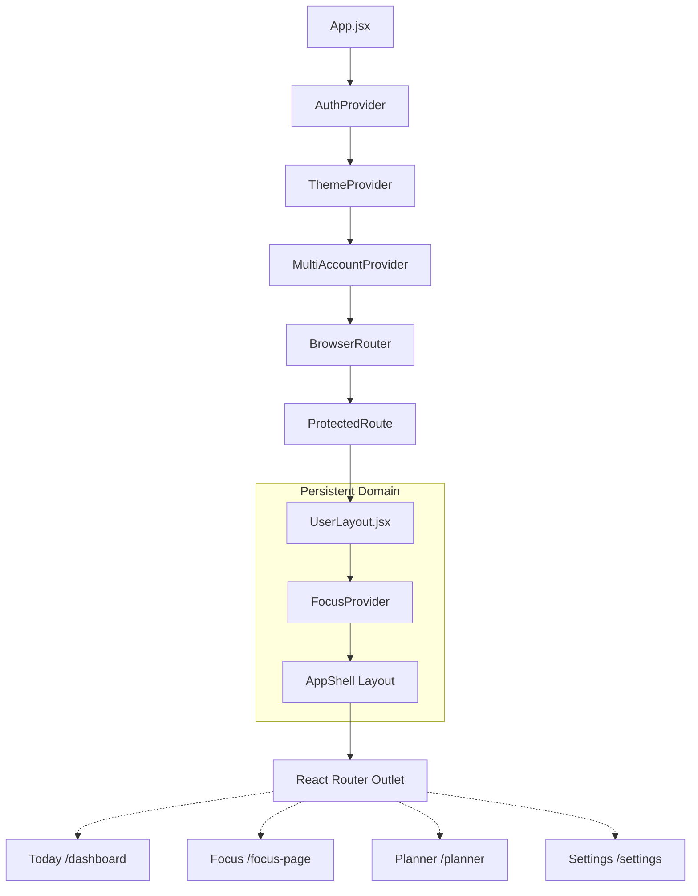
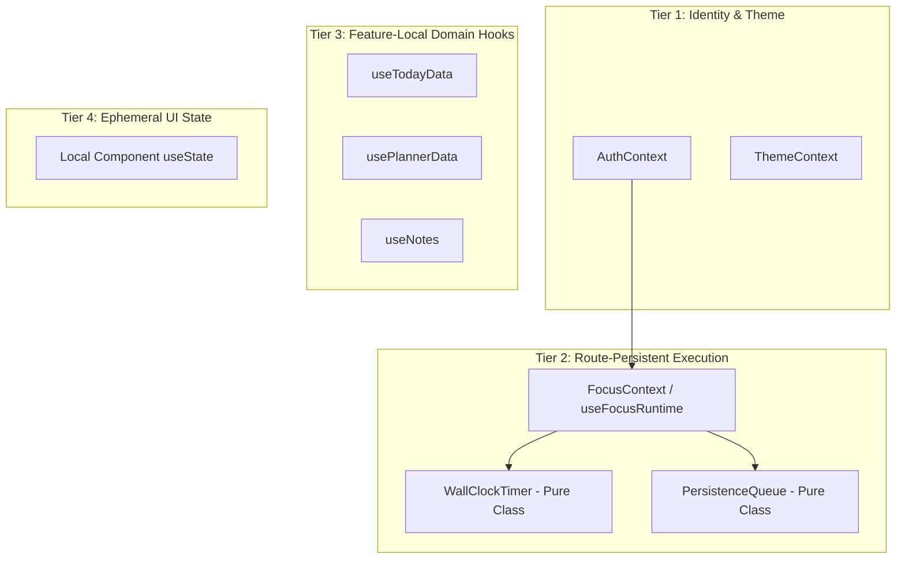

# Frontend Architecture

Athena's frontend is constructed with React 19 and bundled via Vite. It enforces strict separation between visual presentation, business domain hooks, and route-persistent runtime services.

---

## Directory Organization & Feature Boundaries

The client code resides in `frontend/src/` organized into domain features:

```text
frontend/src/
├── app/                  # Application-level providers
├── components/           # Reusable design system (shadcn/ui, layout, desktop titlebar)
├── contexts/             # Global contexts (AuthContext, MultiAccountContext)
├── features/             # Domain feature modules
│   ├── focus/            # Focus execution engine, runtime reducer, timer clock
│   ├── planner/          # Date allocation, goal triage, task board
│   ├── today/            # Command center view and metrics
│   ├── settings/         # Categorized preferences
│   └── profile/          # User identity and credentials
├── pages/                # Route entry components and top-level layouts
│   ├── layouts/          # UserLayout, AdminLayout, AuthLayout
│   └── user/             # Dashboard, FocusSession, Planner, Profile, Settings
├── services/             # HTTP client services (taskService, sessionService, etc.)
└── styles/               # Design tokens, base CSS, theme definitions
```

---

## Layout Hierarchy & Route Persistence

A critical engineering achievement in Athena is the **Route-Persistent Execution Runtime**.

In typical React applications, mounting a runtime inside a route page (e.g. `/focus-page`) causes the runtime, timers, and WebSockets to unmount whenever the user clicks to another tab (e.g. `/planner`).

Athena solves this by embedding `FocusProvider` at the `UserLayout` level:



### Invariant Maintained
The active focus timer, background interval, pause calculations, and uncommitted autosave queue **remain alive** regardless of how many times the user transitions between `/planner`, `/dashboard`, or `/settings`.

---

## State Management Hierarchy

Athena rejects monolithic global stores (e.g., global Redux) in favor of specialized, ownership-driven state tiers:



1. **Authentication & Multi-Account (`AuthContext`, `MultiAccountContext`):** Owns identity, active token state, and account switching.
2. **Theme Architecture (`ThemeContext`):** Owns CSS variables and attributes (`data-theme`), persisting to both user-scoped `localStorage` and backend profile.
3. **Execution Runtime (`FocusContext`):** Governed by `focusReducer.js`, a pure reducer executing state transitions with side-effects captured as explicit declarations.
4. **Domain Feature Hooks (`useTodayData`, `usePlannerData`):** Encapsulate data fetching, sorting, optimistic updates, and cache invalidation for specific screens.
5. **Local Ephemeral State:** Strictly isolated within components via standard React hooks (`useState`, `useRef`).

---

## Design System & Token Strategy

- **Tailwind CSS v4 + Base UI / shadcn:** Standardized semantic utility tokens:
  - Backgrounds: `bg-background`, `bg-card`, `bg-popover`, `bg-secondary`.
  - Foreground: `text-foreground`, `text-card-foreground`, `text-muted-foreground`.
  - Accents: `bg-primary`, `text-primary`, `border-border`.
- **Zero Raw Color Hardcoding:** Components avoid raw Tailwind classes (e.g., `bg-zinc-900` or `text-gray-400`), ensuring complete readability across all 12 supported themes.
