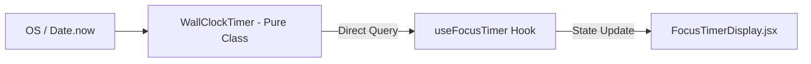

# State Ownership

A primary cause of software regressions in complex productivity tools is ambiguous state ownership—where two subsystems both believe they own the canonical version of an entity. 

Athena enforces strict, non-overlapping ownership boundaries.

---

## State Ownership Matrix

| Entity | Primary Authority | In-Memory Representation | Local Durable Store | Backend Durable Store |
| :--- | :--- | :--- | :--- | :--- |
| **User Identity** | Backend Auth Service | `AuthContext` | HTTP-only Cookie (`jwt`) | MongoDB `User` |
| **Focus Timer Clock**| `WallClockTimer` (Pure JS) | `useRef(WallClockTimer)` | None | MongoDB `Session.duration` |
| **Focus State Machine**| `focusReducer.js` | `FocusContext` state | None | MongoDB `Session` |
| **Session Persistence**| `PersistenceQueue` | `useRef(PersistenceQueue)`| None | MongoDB `Session` (via PATCH) |
| **Task Items** | Backend Task Service | Feature hooks (`useState`)| None | MongoDB `Task` |
| **Schedule Blocks** | Backend Schedule Svc | `useTimeline` hook | None | MongoDB `ScheduleBlock` |
| **Streaks & Daily Stats**| Backend Streak Svc | Derived summary | None | MongoDB `Streak`, `DailyStats`|
| **Theme Token** | User Profile (`User.settings`) | `ThemeContext` | `localStorage: athena_theme_<userId>` | MongoDB `User.settings.theme` |
| **Sidebar State** | Local Workspace Cache | `uiStore` (Zustand) | `localStorage: athena_sidebar_collapsed_<userId>` | None (Local only) |
| **Custom Workspace Layout**| Local Workspace Cache | `useState` | `localStorage: focus_custom_layout_v3_<userId>` | None (Local only) |

---

## Detailed Component Ownership

### 1. Timer Clock vs. UI Rendering
- **Authoritative Clock:** `WallClockTimer` in `frontend/src/features/focus/runtime/TimerClock.js`.
  - Holds `_startTime` and accumulated `_baseMs`.
  - Calculates elapsed milliseconds on demand via `getElapsedMs(now)`.
- **Display Adapter:** `useFocusTimer.js`.
  - Runs `requestAnimationFrame` for 60fps display updates.
  - **Invariant:** If RAF is suspended by a background tab, `useFocusTimer` loses zero state; the moment the tab becomes visible, it queries `WallClockTimer.getElapsedMs()`, snapping directly to the accurate wall-clock time.

### 2. Focus Reducer vs. Backend Database
- **Reducer Authority:** `focusReducer.js` owns the canonical session lifecycle phase (`IDLE`, `RUNNING`, `PAUSED`, `COMPLETED`).
- **Effect Dispatch:** When a state transition occurs (e.g., `START`), the reducer outputs declarative effects (e.g., `EFFECTS.POST_SESSION`).
- **Queue Protection:** `useFocusRuntime` translates these effects into `PersistenceQueue` calls. If the client disconnects, the reducer remains authoritative in memory until the queue drains.

### 3. Task State: Today vs. Planner vs. Focus Todos
- **Tasks (`Task` Model):** Created, updated, and deleted through `taskService.js`.
- **Focus Todos (`Session.todos`):**
  - Stored inside the active `Session` document.
  - When a focus session begins with linked tasks, task titles are hydrated into `Session.todos`.
  - **Crucial Invariant:** Modifying or checking off a session todo does **not** automatically mutate the global `Task.status`. The focus session checklist is local to that execution block.

### 4. Theme & Appearance
- **Write Path:**
  1. User selects theme in UI.
  2. `ThemeContext` updates React state immediately (optimistic).
  3. `ThemeContext` sets `document.documentElement.setAttribute('data-theme', theme)`.
  4. Writes to user-scoped `localStorage` (`athena_theme_${userId}`).
  5. Asynchronously sends `userService.updateSettings({ theme })` to update MongoDB `User.settings.theme`.
- **Read Path on Startup:**
  - Fast-read from user-scoped `localStorage` to avoid flash-of-unstyled-content (FOUC).
  - Validates and reconciles against `User.settings.theme` upon `/auth/check-auth` resolution.
