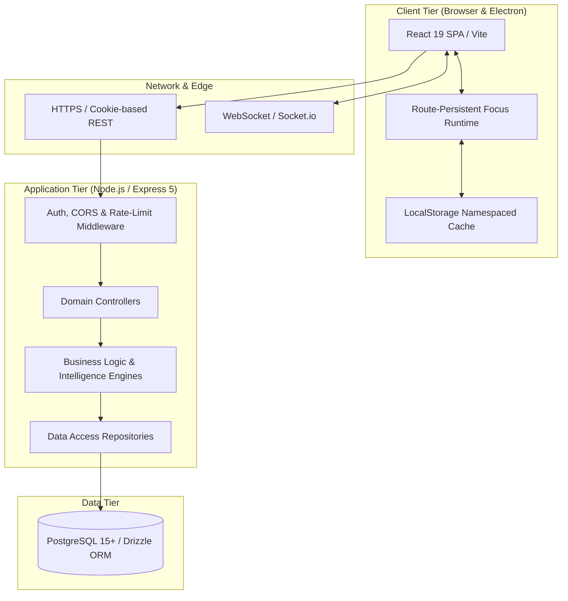

# System Architecture

Athena is engineered as a decoupled, multi-tiered client-server system. It couples an asynchronous web and desktop frontend with a RESTful Node.js API and relational PostgreSQL persistence managed through Drizzle ORM.

---

## Macro System Topology

---

## Component Responsibilities

### 1. Client Tier (Frontend)
- **Framework:** React 19, Vite, TailwindCSS (v4), shadcn/ui primitives.
- **Packaging:** Runs both as a responsive browser SPA and as an Electron desktop app (`npm run dev:desktop`).
- **Core Architecture:**
  - Route-level layout boundaries (`UserLayout`, `AdminLayout`, `AuthLayout`).
  - Route-persistent execution state machine mounted at `UserLayout` level ([[Focus Runtime]]).
  - Strict namespacing for multi-tenant workstation caching ([[Multi Account Isolation]]).

### 2. Transport Tier
- **Authentication Credentials:** Handled via HTTP-only, secure, SameSite cookies (`jwt`), eliminating token theft via cross-site scripting (XSS).
- **Rate Limiting:** Granular rate-limit tiers configured in `backend/server.js`:
  - `authLimiter`: 100 requests / 15 min (brute-force protection).
  - `apiLimiter`: 200 requests / 15 min (standard CRUD).
  - `heavyLimiter`: 1000 requests / 15 min (high-frequency autosave and session heartbeats).
- **Real-Time Sockets:** Socket.io server initialized in `backend/config/socket.js` for lightweight event dispatch.

### 3. Application Tier (Backend)
- **Framework:** Express 5 on Node.js (ES modules).
- **Design Pattern:** Strictly layered `Route → Middleware → Controller → Service → Repository → Database`.
- **Stateless Execution:** Server processes maintain no in-memory session locks. Any server instance can fulfill any user request via stateless JWT validation against PostgreSQL.
- **Engines:**
  - `targetEngine.js` & `targetService.js`: Adaptive 7-day rolling target adjustment.
  - `capacityEngine.js`: Rolling median workload capacity & 130% overload detection.

### 4. Persistence Tier
- **Database:** PostgreSQL (15+) configured through Drizzle ORM schema definitions in `backend/db/schema/`.
- **Primary Entities:**
  - `users`: Core profile, credentials, preferences JSONB, timezone.
  - `tasks` & `taskOccurrences`: Canonical tasks and calendar-date occurrence snapshots.
  - `scheduleBlocks`: Time blocks linked to tasks and focus sessions.
  - `sessions`, `sessionSegments`, `sessionPauseEvents`, `sessionFeedback`: Hardware-accurate focus telemetry.
  - `streaks` & `dailyStats`: Daily habit progression, freeze records, and performance metrics.
  - `goals` & `notes`: Strategic containers and Tiptap rich notes.

