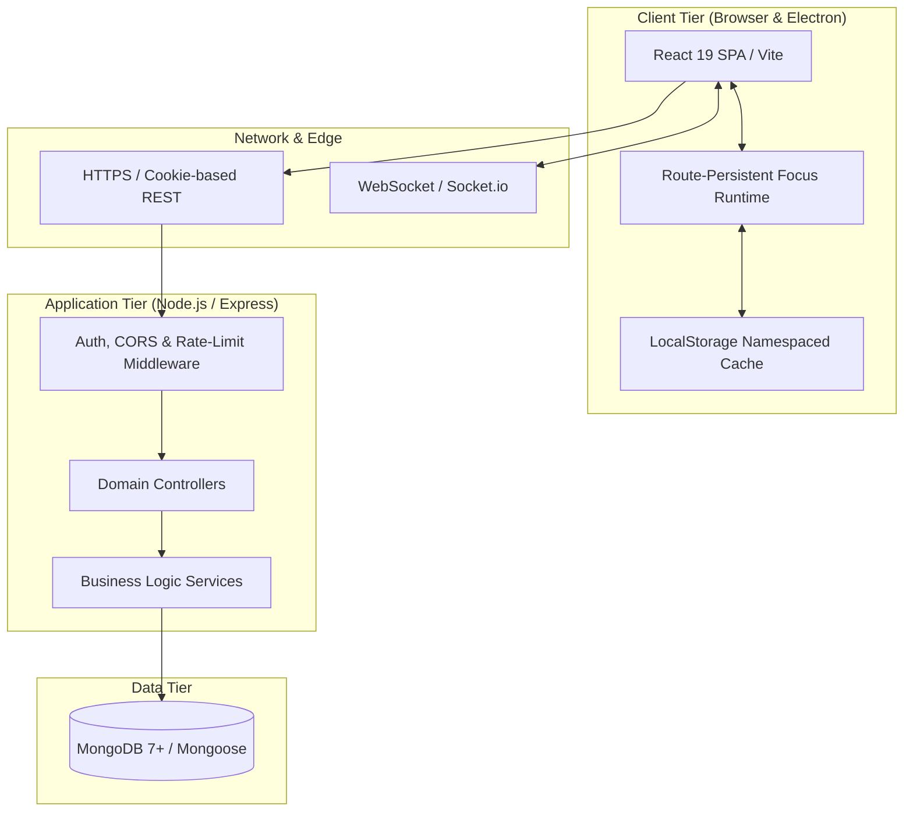

# System Architecture

Athena is engineered as a decoupled, multi-tiered client-server system. It couples an asynchronous web and desktop frontend with a RESTful Node.js API and document-oriented MongoDB persistence.

---

## Macro System Topology

---

## Component Responsibilities

### 1. Client Tier (Frontend)
- **Framework:** React 19, Vite, TailwindCSS (v4), shadcn/ui primitives.
- **Packaging:** Runs both as a responsive browser SPA and as an Electron desktop app (`npm run dev:desktop`).
- **Core Architecture:**
  - Route-level layout boundaries (`UserLayout`, `AdminLayout`, `AuthLayout`).
  - Route-persistent execution state machine mounted at `UserLayout` level ([[Focus Runtime]]).
  - Strict namespacing for multi-tenant workstation caching ([[Multi Account Isolation]]).

### 2. Transport Tier
- **Authentication Credentials:** Handled via HTTP-only, secure, SameSite cookies (`jwt`), eliminating token theft via cross-site scripting (XSS).
- **Rate Limiting:** Granular rate-limit tiers configured in `backend/server.js`:
  - `authLimiter`: 100 requests / 15 min (brute-force protection).
  - `apiLimiter`: 200 requests / 15 min (standard CRUD).
  - `heavyLimiter`: 1000 requests / 15 min (high-frequency autosave and session heartbeats).
- **Real-Time Sockets:** Socket.io server initialized in `backend/config/socket.js` for lightweight event dispatch.

### 3. Application Tier (Backend)
- **Framework:** Express on Node.js (ES modules).
- **Design Pattern:** Strictly layered `Route → Middleware → Controller → Service → Model`.
- **Stateless Execution:** Server processes maintain no in-memory session locks. Any server instance can fulfill any user request via stateless JWT validation against MongoDB.

### 4. Persistence Tier
- **Database:** MongoDB configured through Mongoose schemas.
- **Indexes:** Compound indexes enforced on high-frequency queries:
  - `Session`: `{ sessionId: 1, userId: 1 }` (unique), `{ userId: 1, createdAt: -1 }`, `{ scheduleBlockId: 1, userId: 1 }`.
  - `ScheduleBlock`: `{ userId: 1, date: 1 }`, `{ taskId: 1, userId: 1 }`, `{ sessionId: 1, userId: 1 }`.
  - `Task`: `{ user: 1, status: 1 }`, `{ goal: 1 }`.
  - `DailyStats`: `{ userId: 1, date: 1 }`.
  - `Streak`: `{ userId: 1 }` (unique).
