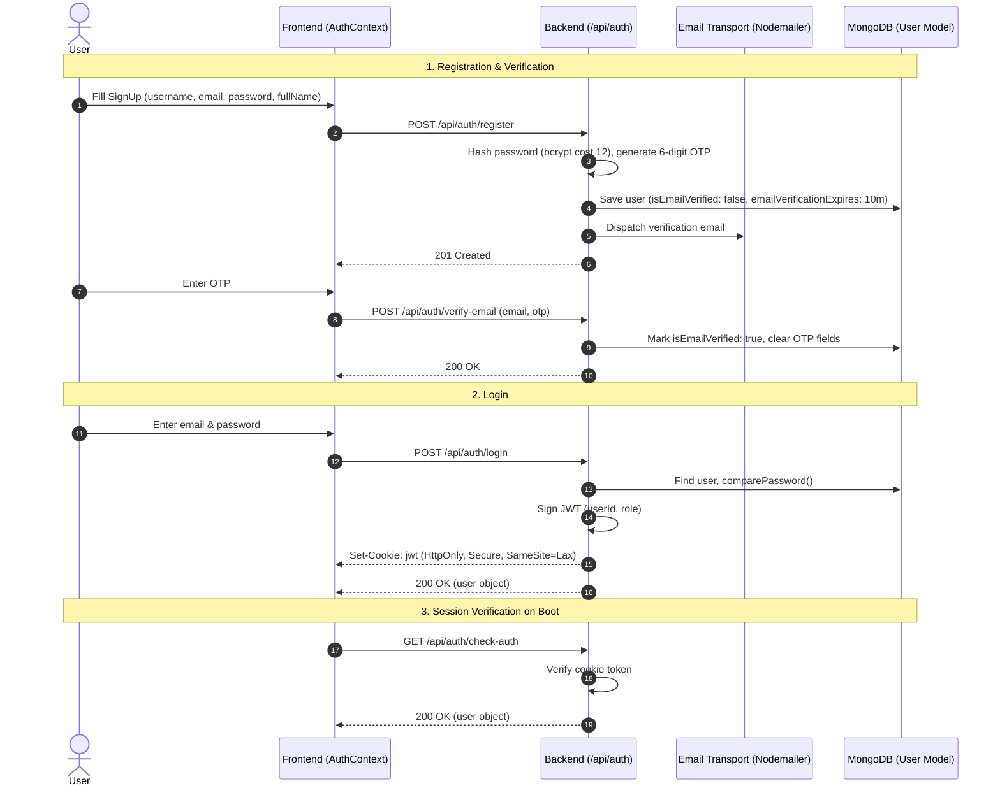

# Authentication

Athena implements secure, stateless authentication using JSON Web Tokens (JWT) distributed exclusively via HTTP-only cookies.

---

## Authentication Flow

---

## Cookie Security Configuration

The authentication cookie is generated with the following security flags:
- `httpOnly: true`: Inaccessible to client-side JavaScript (`document.cookie`), preventing credential extraction via XSS.
- `secure: process.env.NODE_ENV === "production"`: Enforced over HTTPS in production.
- `sameSite: "lax"`: Protects against Cross-Site Request Forgery (CSRF).
- `maxAge: 7 * 24 * 60 * 60 * 1000`: 7-day expiration window.

---

## Multi-Account Management (`MultiAccountContext`)

Athena supports instant switching between multiple authenticated profiles on the same workstation:
- `MultiAccountProvider` stores accounts in client memory/storage.
- When an account switch is triggered, credentials for the selected account re-authenticate, resetting user-scoped cached state.
- **Invariant:** Switching accounts explicitly resets all `userStateService` scopes, ensuring no data bleed between accounts (see [[Multi Account Isolation]]).

---

## Password Reset Workflow

1. **Request:** User sends `POST /api/auth/request-password-reset` with `email`.
2. **Generation:** Server verifies email, writes `passwordResetOTP` and expiration (10 min) to `User` document, and dispatches an email.
3. **Execution:** User submits `POST /api/auth/reset-password` with `email`, `otp`, and `newPassword`.
4. **Validation:** Server verifies OTP validity, hashes the new password via Mongoose `pre("save")`, clears the reset fields, and completes the reset.
