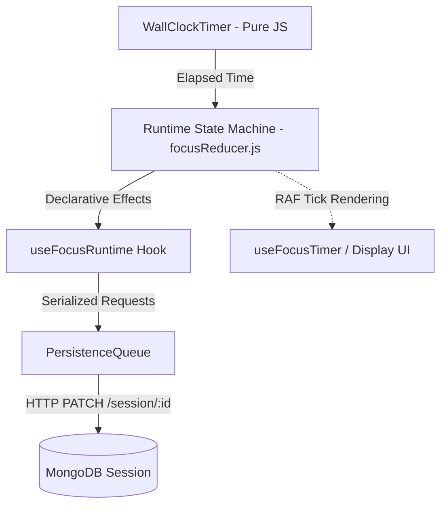
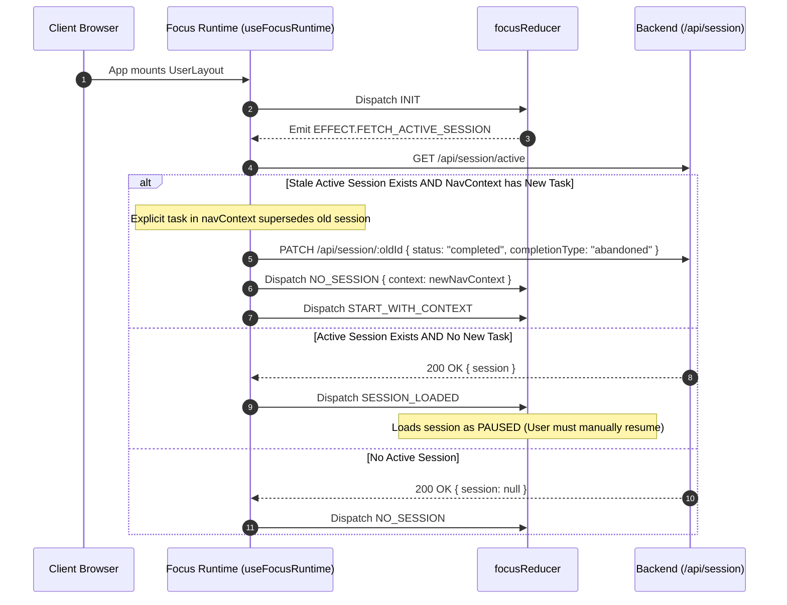

# Focus Runtime

The Focus Runtime is the architectural core of Athena’s execution engine. It coordinates timer accuracy, state machine transitions, background synchronization, and crash recovery.

---

## Authoritative State Hierarchy

---

## 1. WallClockTimer (`TimerClock.js`)

A pure TypeScript/JavaScript class with zero React or DOM dependencies.

- **Formula:**
  $$\text{elapsed} = \text{\_baseMs} + (\text{now} - \text{\_startTime})$$
- **Invariants:**
  - `start(atMs = Date.now())`: Records `_startTime` and sets `running = true`.
  - `pause(atMs = Date.now())`: Folds `atMs - _startTime` into `_baseMs`, clearing `_startTime`.
  - `getElapsedMs(now)`: Evaluates dynamic elapsed time on demand.
  - **No Drift Guarantee:** Immune to tab throttling, OS sleep, and delayed animation frames.

---

## 2. The Reducer State Machine (`focusReducer.js`)

The session state machine is a pure function:

$$\text{transition}(\text{state}, \text{event}) \longrightarrow \{ \text{state}, \text{effects} \}$$

### Core Lifecycle Phases (`PHASES`):
- `IDLE`: No active session; awaiting user launch.
- `LOADING`: Checking for active session on backend or booting.
- `RUNNING`: Focus or break timer actively progressing.
- `PAUSED`: Timer suspended; pause event recording.
- `COMPLETED`: Session finished naturally or ended early; awaiting review.

### Declarative Effects (`EFFECTS`):
- `FETCH_ACTIVE_SESSION`: Triggered on boot to check for recoverable sessions.
- `POST_SESSION`: Dispatched when a new session starts to write the initial document.
- `PATCH_SESSION_PROGRESS`: Dispatched during interval changes or periodically.
- `COMPLETE_SESSION`: Dispatched when all segments finish or the user stops early.
- `START_TIMER` / `PAUSE_TIMER` / `RESET_TIMER`: Imperative bridges to `WallClockTimer`.

---

## 3. PersistenceQueue (`PersistenceQueue.js`)

A single-worker FIFO serialization queue managing HTTP writes to `/api/session/:id`.

- **Race Elimination:** Ensures only one PATCH is in-flight at a time.
- **Supersede Policy:** If a `complete` or `discard` request arrives while a periodic `progress` write is queued, the progress write is purged from the queue.
- **Retry Mechanism:** Automatically retries failed network writes up to 3 times with exponential backoff before reporting an error state.

---

## 4. Session Recovery & Boot Scenarios

---

## Documented Lifecycle Bug Fixes

During recent architectural stabilization audits, the following six critical issues were identified and resolved:

### 1. Focus Timer Destroyed on Navigation
- **Root Cause:** Focus runtime originally resided inside `FocusSession.jsx`. Clicking away to `/planner` unmounted the component, destroying the timer.
- **Fix:** Lifted `FocusProvider` to `UserLayout.jsx`, making the runtime route-persistent across all user pages.

### 2. Old Session Overriding New Selected Task
- **Root Cause:** `getActiveSession()` automatically re-hydrated an old database session, ignoring the incoming `navContext` containing a newly selected task.
- **Fix:** Added `hasExplicitNewTask` guard in `useFocusRuntime.js`. If navigation state contains an explicit task, any stale active session is marked abandoned and the new task boots immediately.

### 3. Old Duration Overriding Modal Duration
- **Root Cause:** Duration chosen in `DurationModal` was dropped during session re-hydration, defaulting back to 25m or the previous session's planned duration.
- **Fix:** Explicitly piped `navContext.plannedDuration` through `startWithContext` into reducer initialization and POST payload.

### 4. Reducer State Leaking Between Sessions
- **Root Cause:** Discarding or resetting a session left residual segment indices and pause arrays in memory.
- **Fix:** Added explicit `INITIAL_STATE` reset in `focusReducer.js` on `DISCARD`, `RESET`, and `NO_SESSION`.

### 5. 45-Minute Segment Partition Bug
- **Root Cause:** `createSegments` in `segmentUtils.js` partitioned 45-minute blocks into four 10-minute focus chunks with breaks instead of a dedicated focus interval.
- **Fix:** Restructured `createSegments` to generate a single continuous focus block for durations $\le 45\text{m}$, reserving Pomodoro partitioning for long multi-hour blocks.

### 6. Review Bypass on Early Discard
- **Root Cause:** Stopping a session early discarded the session without capturing reflection metrics.
- **Fix:** Added `EVENTS.DISCARD`, transitioning early-stopped sessions to `COMPLETED` with `completionType: 'abandoned'`, opening [[Session Review]] with an early-exit layout and skip option.
