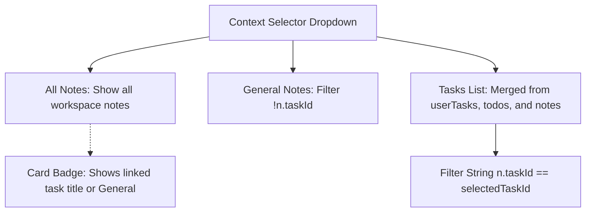

# Notes

Athena integrates rich-text documentation, scratchpads, and context-linked notes directly into the productivity workspace.

---

## Editor & Rendering Engine

- **Technology:** TipTap (ProseMirror wrapper) with `StarterKit`, `Placeholder`, and `Image` extensions.
- **Rendering:** Responsive markdown-prose styling with support for headings, bold, italic, strikethrough, bullet lists, ordered lists, and blockquotes.
- **Autosave Pipeline:** Debounced background sync (800ms for content, 600ms for title) dispatching updates via `notesService.updateNote(id, payload)`.

---

## Context-Linking Architecture

In `frontend/src/features/focus/components/notes/Notes.jsx`, notes support multi-context filtering:

### Context Modes:
1. **All Notes:** Displays every note created by the user across all contexts.
2. **General Notes:** Filters exclusively for unassigned scratchpad entries (`!note.taskId`).
3. **Task-Specific Notes:** Filters for notes created specifically under a selected task ID.

### Task Synthesis:
`Notes.jsx` automatically queries `taskService.getTasks()` on mount and merges results with active session `todos`. As a result, the user can link notes to any backlog task or session item regardless of the active focus phase.
