# Session Review

The Session Review modal (`SessionReview.jsx`) is the critical bridge between raw execution and behavioral reflection.

---

## Interaction Architecture & Flow

Whenever a focus session terminates (`completionType: "completed"` or `"abandoned"`), the workspace transitions to the Review screen.

```mermaid
graph TD
    Terminated[Session Terminates] --> OpenReview[Mount SessionReview Modal]
    OpenReview --> Rating1[Rate Mood 1-5]
    OpenReview --> Rating2[Rate Focus Depth 1-5]
    OpenReview --> Distractions[Select / Type Distractions]
    OpenReview --> Notes[Session Reflection Notes]
    
    Rating1 & Rating2 & Distractions & Notes --> Submit[Submit Review]
    Submit --> SaveAPI[POST /api/session/:id/feedback]
    SaveAPI --> UpdateStreak[Recalculate Daily Stats]
    UpdateStreak --> ResetRuntime[Reset Runtime to IDLE]
```

---

## Metric Capture Specifications

### 1. Mood Rating (1 to 5)
- Standardized numeric scale capturing emotional energy and friction:
  - `1`: Exhausted / Frustrated
  - `2`: Drained / Low Energy
  - `3`: Neutral / Steady
  - `4`: Clear / Satisfied
  - `5`: Energized / Flow

### 2. Focus Depth (1 to 5)
- Subjective measure of cognitive immersion:
  - `1`: Highly Fragmented
  - `2`: Restless
  - `3`: Moderate Focus
  - `4`: Deep Immersion
  - `5`: Peak Flow State

### 3. Distraction Categorization
- Pre-populated chips derived from in-session logs:
  - *Phone, Messages, People, Noise, Web Browsing, Mind Wandering*.
- Dedicated text input for freeform root-cause reflection (e.g., "Compiler errors caused frustration", "Slack notification interrupted logic flow").

### 4. Empathetic Discard Mode
When `isDiscarded` is true:
- Replaces standard celebratory copy with supportive guidance: *"Session Ended Early — Every minute of deliberate focus counts. What caused you to stop early?"*
- Explicit **Skip Review** button available, allowing users to bypass reflection without losing accumulated elapsed focus seconds.
