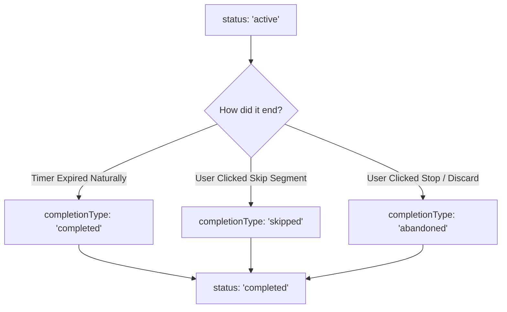

# Sessions

A Focus Session represents an actual historical record of deep work execution.

---

## Session Model Fields & Semantics

Defined in `backend/models/sessionModel.js`:
- `sessionId` (String, required, unique index): Client-generated UUID string preventing collision across clients.
- `userId` (ObjectId, ref: `User`, required, indexed).
- `taskIds` ([ObjectId], ref: `Task`): Array of tasks focused on during this session.
- `scheduleBlockId` (ObjectId, ref: `ScheduleBlock`, default: null): Linked timeline block.
- `title` (String, required): Session title (e.g. "Implement Auth Middleware" or "Untitled Work").
- `sessionType` (Enum): `"task" | "quick"`. Default: `"quick"`.
- `status` (Enum): `"active" | "completed"`. Default: `"active"`.
- `completionType` (Enum): `"completed" | "skipped" | "abandoned"`. Set when `status` becomes `"completed"`.
- `plannedDuration` (Number): Intended focus duration in seconds.
- `duration` (Number): Actual elapsed focus time in seconds (excluding break and pause intervals).
- `sessionSegments`: Structured array of `{ type: "focus" | "break", duration, totalDuration, startedAt, completedAt }`.
- `pauseEvents`: Structured array of `{ id, startTime, endTime, duration, reason }`.
- `sessionStats`: Aggregated metrics `{ pauseCount, totalPauseDuration, focusSegmentsCompleted, breakSegmentsCompleted, interruptions }`.
- `sessionFeedback`: Post-session review data `{ mood, focus, distractions, submittedAt }`.
- `todos`: Session-specific execution checklist.

---

## Completion Types & State Mapping

### 1. `completed`
- Triggered when all planned focus segments complete naturally.
- Marks full planned minutes toward daily streak goals.

### 2. `abandoned`
- Triggered when a user clicks Stop or Discards early.
- Stores accumulated focus seconds up to the moment of abandonment.
- Prompts for reflection in [[Session Review]] under "Session Ended Early" mode.

### 3. `skipped`
- Triggered when a break or segment is manually bypassed.

---

## Multiple Sessions on a Single Task

Athena supports an arbitrary number of focus sessions on the same task. 
- A task with `_id: "67a..."` can be linked across 10 distinct session documents.
- Sessions do not overwrite task data; they accumulate independent execution histories.
