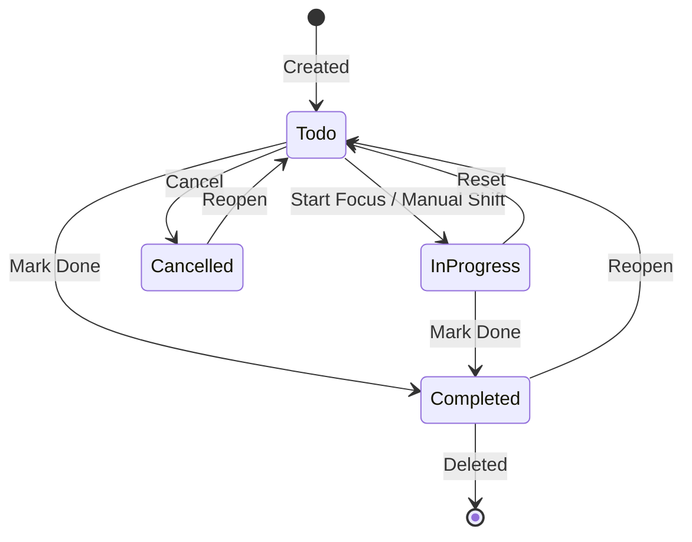

# Tasks

Tasks represent the foundational unit of planned and actionable work within Athena.

---

## Schema & Attributes

Documented in `backend/models/taskModel.js`:
- `title` (String, required): Concise task description (max 200 characters).
- `description` (String): Extended markdown notes or specifications.
- `status` (Enum): `"todo" | "in-progress" | "completed" | "cancelled"`. Default: `"todo"`.
- `priority` (Enum): `"low" | "medium" | "high"`. Default: `"medium"`.
- `order` (Number): Float/integer sort order for drag-and-drop sequencing.
- `dueDate` (Date): External deadline milestone.
- `plannedDate` (Date): Internal calendar date intended for execution.
- `goal` (ObjectId, ref: `Goal`): Parent goal container.
- `tags` ([String]): Freeform categorization strings.

---

## Task Lifecycle & Invariants

### Invariant 1: Independent Completion
Completing a task does **not** terminate an active Focus session, nor does finishing a Focus session mark the task complete. The user may spend five consecutive sessions on a single task before marking it completed.

### Invariant 2: Reopening Permitted
A completed or cancelled task can be reopened at any time, returning its status to `"todo"`.

### Invariant 3: Ordering
When reordered in [[Planner]] or [[Today]], a batch `PATCH /api/task/reorder` payload containing ordered IDs updates the `order` index, maintaining stable user-defined visual order.

---

## Current Omissions & Technical Gaps

The following fields do **not** exist in the current `Task` model:
- `estimatedDuration`: No field exists on the task to store estimated minutes.
- `actualDuration`: Accumulated focus time is stored on `Session`, not aggregated on `Task`.
- `completedAt`: When `status` changes to `"completed"`, no dedicated completion timestamp is recorded.
- `recurrence`: No recurrence rule or recurring occurrence generation exists.
