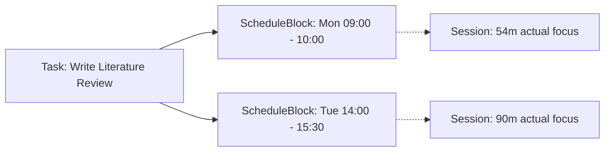

# Timeline

Timeline provides a day-grid calendar interface for allocating explicit clock time to [[Tasks]].

---
## Task vs. ScheduleBlock Distinction

A fundamental architectural principle in Athena is that **a Task is not a ScheduleBlock**:

| Attribute | Task (`Task` Model) | ScheduleBlock (`ScheduleBlock` Model) |
| :--- | :--- | :--- |
| **Question Answered** | *What* needs to be done? | *When* do I intend to do it? |
| **Temporal Nature** | Milestone/Deadline date (`plannedDate`, `dueDate`). | Concrete clock interval (`09:00 - 10:30`). |
| **Cardinality** | 1 Task. | Many ScheduleBlocks can point to the same Task. |
| **Execution Reality** | Goal objective. | Planned calendar container. |



---

## Grid Mechanics & Interactions

- **Block Creation:** Dragging an unallocated task onto the timeline creates a `ScheduleBlock` with `startTime`, `endTime`, `durationMinutes`, and `date`.
- **Drag-to-Move:** Translates `startTime` and `endTime` while preserving `durationMinutes`.
- **Edge Resizing:** Adjusts `endTime` and recalculates `durationMinutes`.
- **Overlaps:** Supported visually via multi-column side-by-side positioning; blocks do not destructive-overwrite overlapping intervals.
- **Focus Launch:** Clicking a ScheduleBlock navigates to Focus with:
  ```javascript
  {
    taskIds: [block.taskId],
    title: task.title,
    source: "timeline",
    scheduleBlockId: block._id,
    startTime: block.startTime,
    endTime: block.endTime,
    plannedDuration: block.durationMinutes * 60,
  }
  ```
