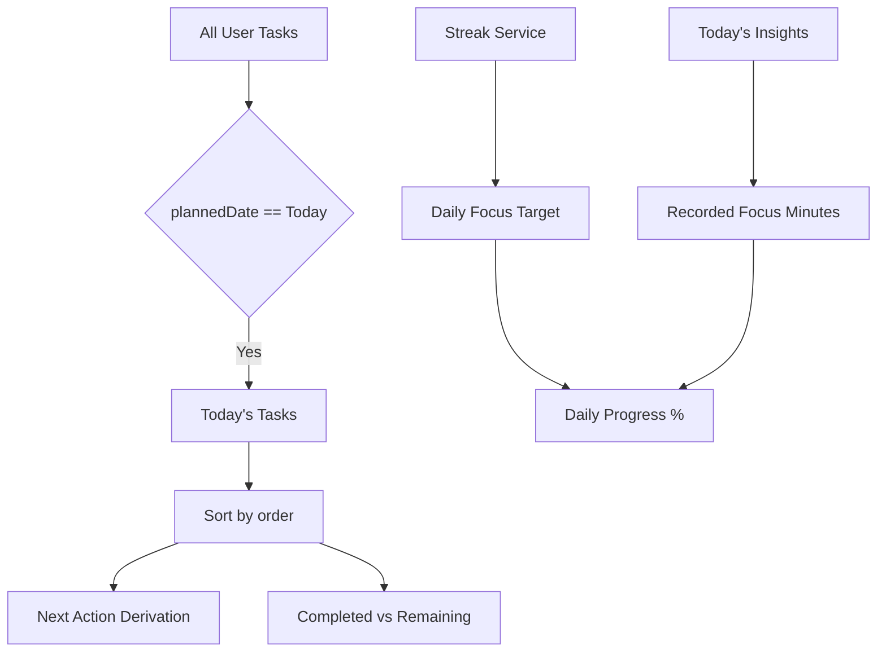

# Today

The Today dashboard (`/dashboard`) serves as the operational command center for the current day. It aggregates immediate tasks, surfaces the primary Next Action, and visualizes daily progress against focus targets.

---
## Data Model & Derivation (`useTodayData.js`)

Today does not maintain a dedicated database table. Instead, it aggregates data dynamically across multiple services:
1. `taskService.getTasks()`: Fetches all user tasks.
2. `streakService.fetchStreak()`: Fetches active streak status and daily target.
3. `sessionService.getTodaysInsights()`: Fetches aggregated focus time and distraction counts for the day.



---

## Functional Components

### 1. Today's Planned Tasks
- **Filter Rule:** `new Date(task.plannedDate).toDateString() === new Date().toDateString()`.
- **Order:** Sorted by `task.order` ascending.

### 2. Next Action Derivation
- Automatically derived as the first task in `todayTasks` where `status !== "completed"` and `status !== "cancelled"`.
- Displayed prominently in the command center card with quick action: **Start Focus**.

### 3. Focus Target & Progress
- Displays `streak.dailyTargetMinutes` (default: 25 minutes).
- Measures `streak.focusMinutes` accumulated across completed or in-progress sessions.
- Computes progress percentage: $\min(100, \text{round}((\text{focusMinutes} / \text{targetMinutes}) \times 100))$.

### 4. Direct Focus Handoff
- Clicking **Start Focus** on any task triggers:
  ```javascript
  navigate("/focus-page", {
    state: {
      taskIds: [task._id],
      title: task.title,
      source: "today",
      plannedDuration: 25 * 60,
    }
  });
  ```
- **Invariant:** Session creation is owned strictly by the [[Focus Runtime]] after navigation, completely eliminating duplicate session initialization races.

---

## Current Known Limitations

- **Overdue Task Invisibility:** If a task was planned for yesterday and left uncompleted, `new Date(task.plannedDate).toDateString() === todayStr` evaluates to `false`. As a result, **overdue tasks vanish from Today** unless viewed in [[Planner]]. Resolving this is part of the planned work in [[Product Decisions]].
