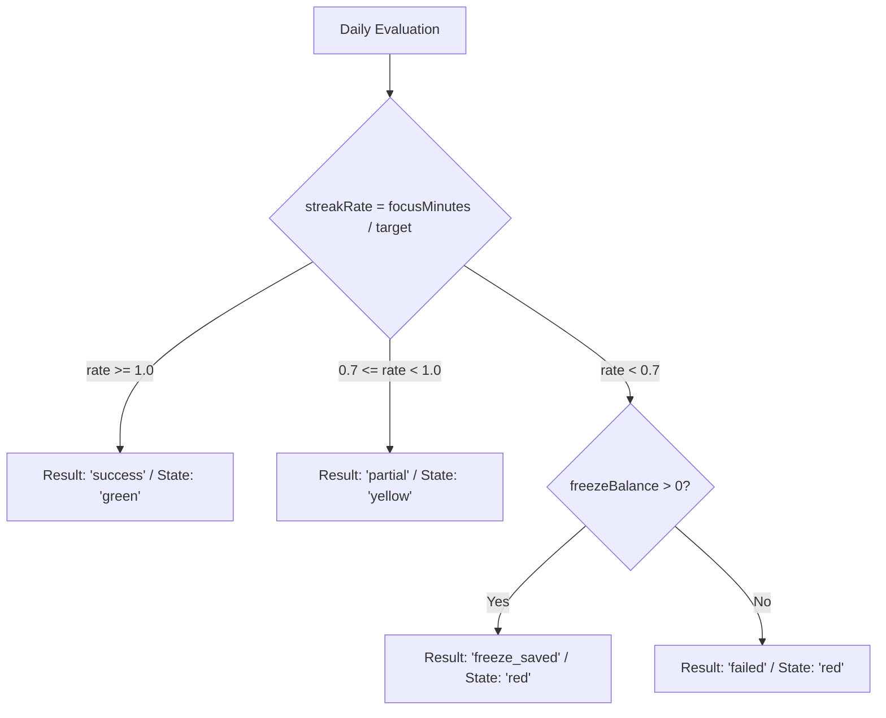

# Daily Outcome Model

Athena models days as categorical achievement outcomes rather than arbitrary numeric tallies.

---

## The Four Daily Outcome Categories

Every day evaluated by `backend/services/streakService.js` resolves into one of four mutually exclusive outcome types:

| Result Type | Color State | Condition | Streak Consequence |
| :--- | :--- | :--- | :--- |
| **`success`** | `green` | $\text{streakRate} \ge 1.0$ | Streak increments by 1. |
| **`partial`** | `yellow` | $0.7 \le \text{streakRate} < 1.0$ | Streak is preserved (no change). |
| **`freeze_saved`** | `red` | $\text{streakRate} < 0.7$ & $\text{freezes} > 0$ | 1 freeze consumed; streak preserved. |
| **`failed`** | `red` | $\text{streakRate} < 0.7$ & $\text{freezes} == 0$ | Streak resets to 0. |

---

## Locked Future Evolution: Planned Work Consistency

In accordance with [[Product Decisions]], the Daily Outcome Model will evolve from raw focus minutes to **planned work completion rate**:
- **Success:** User executed $\ge 80\%$ of their planned daily tasks / schedule blocks.
- **Partial:** User executed $50–79\%$ of planned work.
- **Neutral / Rescheduled:** User triaged unfinished work to future days; marked neutral rather than failed.
- **Failed:** Zero execution without rescheduling or freeze protection.
