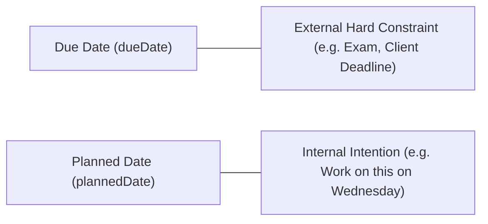

# Planning Model

The Planning Model defines how intention is mapped to calendar days, and the behavioral consequences of overdue or rescheduled work.

---

## Due Date vs. Planned Date

Athena makes a strict conceptual distinction between two dates on a `Task`:

- **`dueDate`:** The hard external deadline. Missing this date creates real-world consequences.
- **`plannedDate`:** The internal personal commitment. The user intends to execute work on this day.

---

## Overdue Work Handling

### Current Behavior:
- In [[Planner]], overdue tasks remain visible under previous day columns or backlog filters.
- In [[Today]], tasks where `plannedDate < today` are filtered out (`useTodayData.js` strictly filters for `plannedDate === today`).

### Locked Decision (Pending Implementation):
- **No Silent Auto-Roll:** The system will **never** silently roll uncompleted tasks to Today at midnight. Unfinished tasks planned for Tuesday remain anchored to Tuesday.
- **Explicit Triage:** Unfinished overdue tasks will surface in an explicit morning triage banner:
  - *Reschedule to Today*
  - *Reschedule to Later*
  - *Keep in Backlog*
  - *Mark Cancelled*
