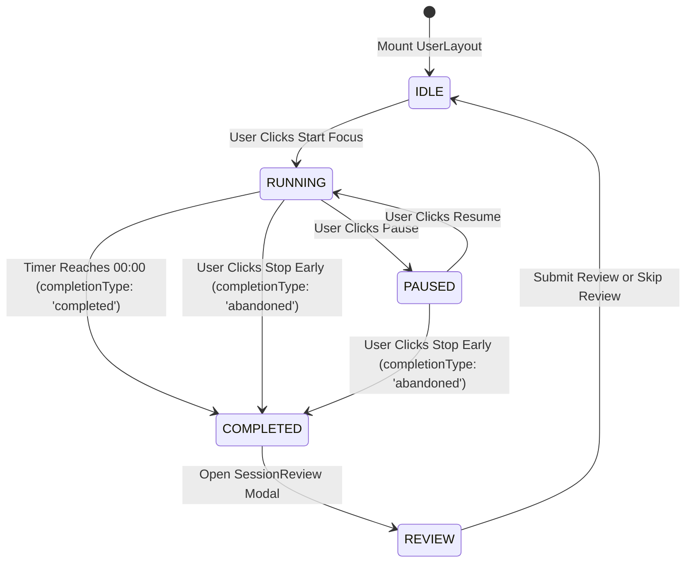

# Session Lifecycle

This document describes the state machine governing `Session` entities from instantiation to final archival.

---

## State Diagram

---

## Lifecycle Steps

1. **Bootstrapping:** User selects duration and task; `useFocusRuntime` dispatches `START_WITH_CONTEXT`.
2. **Backend Instantiation:** Emits `EFFECTS.POST_SESSION`. Sends initial document to `/api/session/start` with `status: "active"`.
3. **Active Ticking:** `WallClockTimer` measures wall-clock seconds. Periodically queues `PATCH /api/session/:id` with current elapsed time.
4. **Interval Transitions:** When focus interval ends, automatically advances `segmentIndex` and transitions to break segment.
5. **Termination:** Dispatches `COMPLETE_SESSION` or `DISCARD`. Updates backend `status: "completed"` and sets `completionType`.
6. **Reflection:** Mounts [[Session Review]], stores `sessionFeedback`, updates daily streak stats, and returns runtime to `IDLE`.
