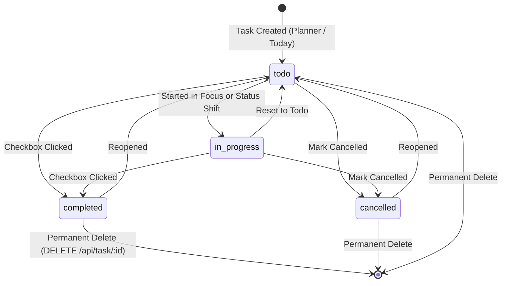

# Task Lifecycle

This document describes the state machine governing [[Tasks]] from initial capture to terminal disposition.

---

## State Transitions

---

## Concrete Semantics

1. **Status Field:** Implemented as an explicit string enum on `Task.status`:
   - `"todo"`: Pending execution.
   - `"in-progress"`: Active engagement.
   - `"completed"`: Finished work.
   - `"cancelled"`: Work dismissed without completion.
2. **Reversibility:** Every transition is fully reversible; completed tasks can be reopened.
3. **No Automatic Mutators:** No automated system process (such as a cron job, timer expiration, or streak calculation) mutates `Task.status`. It is exclusively mutated by explicit user intent.
