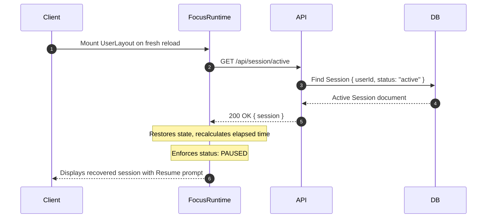

# Persistence and Recovery

This document details how Athena guards against data loss across network disruptions, browser crashes, and route transitions.

---

## 1. Route Persistence
- `FocusProvider` wraps `<AppShell />` at the root of `UserLayout.jsx`.
- When users transition between client routes (`/focus-page`, `/planner`, `/dashboard`, `/settings`), React does not unmount the execution context.
- In-flight timers and unsaved notes continue executing uninterrupted.

---

## 2. Active Session Recovery on Crash / Reload
When a client machine reboots or refreshes mid-session:

- **Safety Invariant:** Recovered sessions always load in a `PAUSED` state. The timer never starts running invisibly upon page reload; the user must explicitly click Resume.

---

## 3. Serialized Persistence Queue
- All write requests to `/api/session/:id` are managed by `PersistenceQueue.js`.
- If a temporary network glitch occurs, writes are queued and retried up to 3 times with exponential backoff.
- On browser `visibilitychange` (e.g., hiding or closing a tab), `queue.flush()` forces an immediate drain of pending writes before unload.
