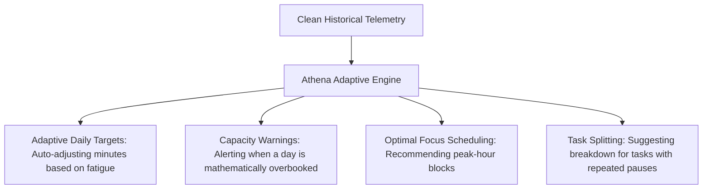

# AI Direction

Athena's AI strategy is grounded in adaptive systems engineering rather than conversational novelty.

---

## What Athena AI Is NOT

Athena will **not** build:
- A generic conversational chatbot in the corner of the screen.
- Hallucinating agents that generate fake tasks.
- Unsupervised autonomous actions that mutate user schedules without confirmation.

---

## What Athena AI IS

Athena’s artificial intelligence will operate as an **observant, adaptive co-pilot** focused on structural planning and burnout defense:

### 1. Dynamic Daily Targets
- Automatically scaling daily focus targets up when consistency is high, and gently dialing targets down when repeated red days or freeze usage signal impending burnout (building upon the unwired prototype in `backend/utils/adaptiveTarget.js`).

### 2. Workload & Capacity Warnings
- Detecting overbooked days before work begins:
  $$\sum \text{Scheduled Durations} > \text{Historical Max Daily Capacity}$$
- Warning the user during morning planning in [[Today]] rather than letting them experience inevitable failure at 11:00 PM.

### 3. Task Avoidance Detection
- Identifying tasks that have been repeatedly planned and rescheduled without active focus time. Prompting the user with non-judgmental interventions: *"This task has been rescheduled 4 times. Would you like to break it into smaller subtasks or move it to Later?"*

---

## Timing on the Roadmap

Athena’s AI layer will be developed **only after** the core engine is stable, the [[Data Collection Audit]] is complete, and reliable behavioral baselines exist.
