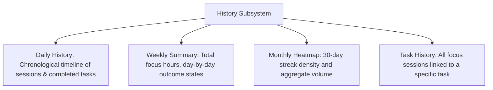

# History

The History subsystem will represent the definitive, chronological audit of actual work accomplished over time.

---

## Architectural Purpose

While [[Planner]] represents future intention and [[Focus]] represents present execution, **History represents past reality**.

It serves as the historical source of truth for:
- When work actually took place.
- How long tasks took compared to original plans.
- Which days were productive vs. interrupted.

---

## Scope & Aggregation Levels (Planned)

### 1. Daily History
- Chronological timeline of all completed and abandoned sessions on a selected date.
- Pauses, interruptions, and reflection notes recorded during each session.

### 2. Task History
- Inspecting a task reveals its historical audit trail:
  - Created date.
  - Days it was planned or rescheduled.
  - Every individual focus session dedicated to it with cumulative hours.
  - Final completion timestamp.

### 3. Current Implementation Status
- Basic session history endpoint exists (`GET /api/session/history` in `backend/controllers/sessionController.js`).
- Advanced multi-dimensional aggregation and task audit trails remain `NEXT` on the roadmap.
