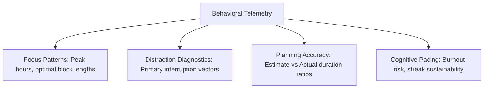

# Insights

The Insights subsystem is designed to interpret historical telemetry, transforming raw numbers into actionable behavioral diagnostics.

---

## Analytical Domains

### 1. Focus Patterns
- **Time-of-Day Adherence:** Identifying whether focus depth ratings peak in mornings or afternoons.
- **Session Duration Sweet Spot:** Correlating focus depth scores against planned session lengths (e.g. diagnosing whether 25m or 50m intervals produce fewer pauses for a specific user).

### 2. Distraction Diagnostics
- Aggregating distraction clicks from [[Session Review]] across weeks.
- Surfacing root-cause frequency: e.g., *"Phone interruptions accounted for 64% of pauses during programming sessions."*

### 3. Planning Accuracy
- Comparing planned schedule blocks against actual recorded focus duration.
- Measuring the ratio of completed tasks to planned tasks per day.

---

## Current Implementation Status
- Basic heuristic generator exists in `backend/utils/generateInsights.js`, calculating daily focus totals and interruption summaries.
- Advanced pattern recognition and predictive diagnostics are planned for `NEXT` following the [[Data Collection Audit]].
