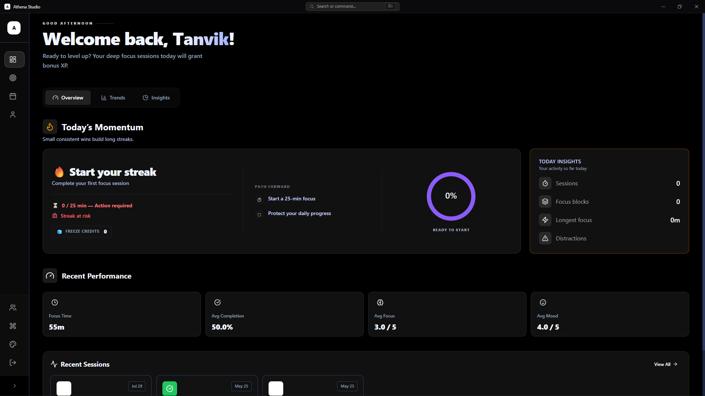
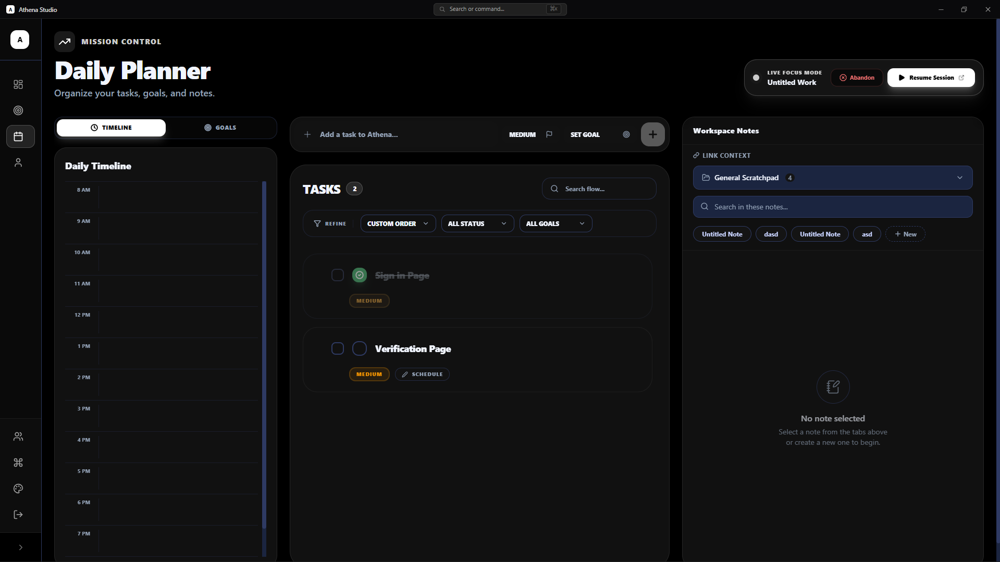
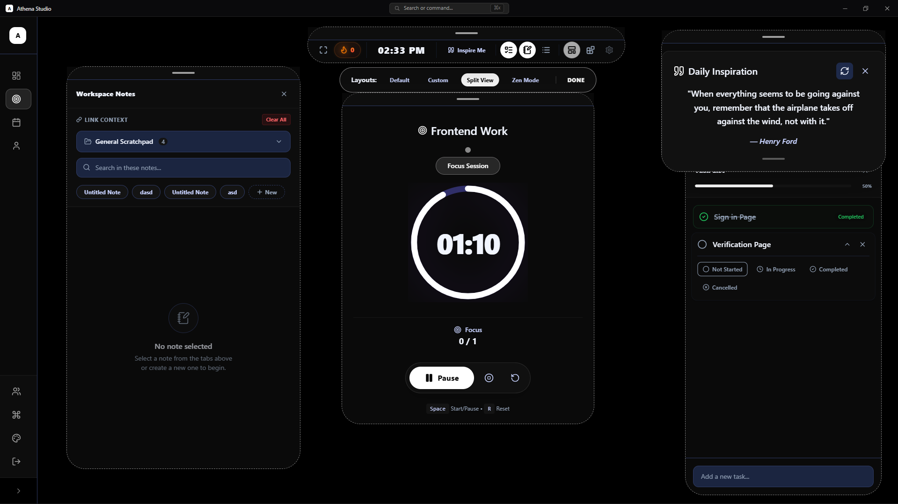
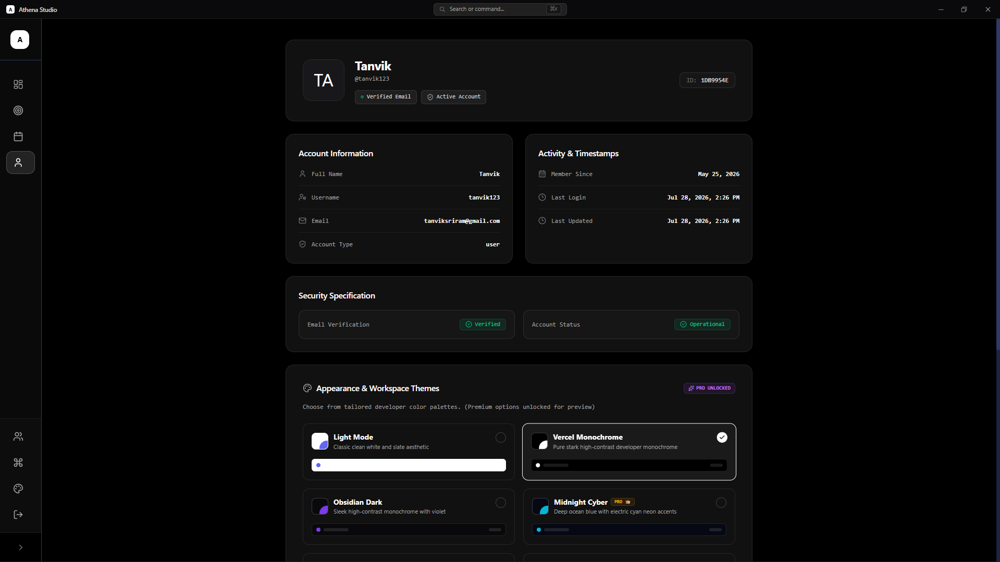
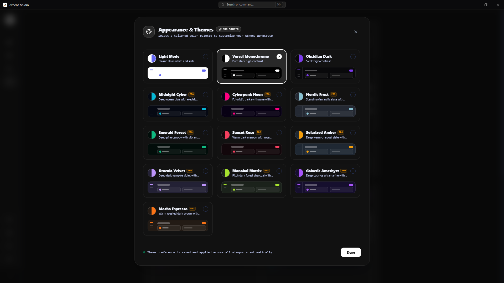
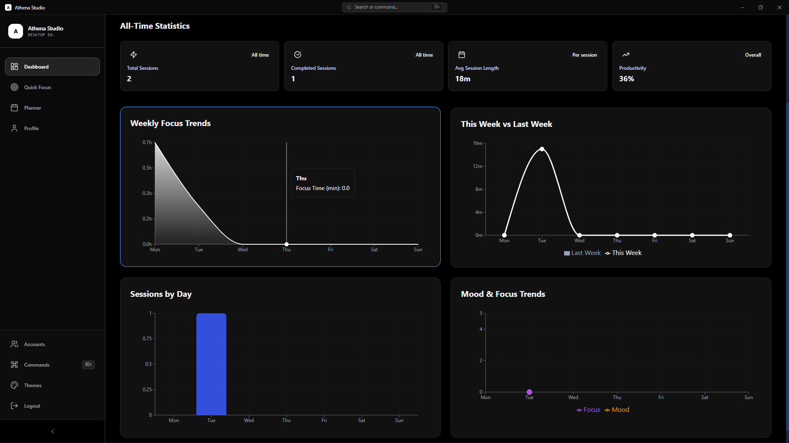

# Athena

Athena is a **focus, planning, and habit tracking system** designed to understand how people actually work — not just how long they run a timer.

Available as a **Native Desktop Application** (built with Electron), Athena tracks **sessions, tasks, goals, notes, streaks, and behavioral patterns** to help users build sustainable productivity habits.

---

## 📸 Screenshots

| Dashboard Analytics | Daily Planner |
| :---: | :---: |
|  |  |

| Quick Focus Sessions | Profile & Streaks |
| :---: | :---: |
|  |  |

| Theme Customization | Dashboard Insights |
| :---: | :---: |
|  |  |

---

# What Athena does (current features)

## Authentication & Multi-Account Support

Secure authentication system built with **cookie-based JWT**.

Features:

* User registration, login & logout
* Email OTP verification & Password reset flow
* Secure **HTTP-only JWT cookies**
* Auth rate limiting
* **Multi-Account Switching**: Easily swap between different user profiles directly within the app without logging out!

## Focus Sessions

Athena's core unit is a **Focus Session**. A session represents a structured period of focused work.

* Start / pause / resume sessions
* Automatic session persistence (Active session recovery on refresh)
* Focus vs break tracking
* Session completion analytics

## Planner System

Athena includes a **daily planner system** that integrates tasks, goals, and notes. Users can plan their work day directly inside the focus tracker.

### Tasks & Goals
* Priority and order for drag-and-drop
* Goal linking to group related tasks into larger objectives
* Completion state tracking

### Notes
* Capture ideas or session insights.
* Optional session linkage (thoughts during focus sessions, study notes).

## Streak System

Athena tracks **daily focus streaks** to help build consistency using **focus minutes and behavior metrics**.

* Daily focus target
* Streak rate calculation & Streak risk detection (Green, Yellow, Red)
* Freeze credits for off days

## Dashboard & Analytics

The dashboard converts raw session data into meaningful insights.

* Total focus time & Sessions completed
* Productivity score & Weekly focus trends
* Focus vs break comparison
* Mood vs focus correlation

## UI & Experience

The frontend focuses on **clarity and responsiveness**.

* **Desktop Native**: Built with Electron for a native OS feel, shortcuts (⌘K Command Palette), and system-level theme synchronization.
* Minimal distraction interface
* Light / dark mode (with multiple color themes!)
* Smooth animations (Framer Motion)
* Skeleton loaders

---

# Architecture & Tech Stack

Athena follows a **layered backend architecture** for a clean separation of logic.

## Frontend
* React 18 (Vite)
* Electron (Desktop App)
* Context API
* Framer Motion
* Recharts & Lucide Icons

## Backend
* Node.js & Express
* MongoDB (Mongoose)
* JWT Authentication
* HTTP-only cookies
* Express Validator
* Rate limiting
* Socket.IO support

## Deployment
* Frontend → Vercel / Electron Packager
* Backend → Render
* Database → Atlas MongoDB

---

# Why I’m building Athena

Most productivity apps either:
• guilt-trip users with streaks
• or show raw data without meaning

Athena tries to sit in the middle:
Track behavior → show patterns → gradually improve focus.

The project also serves as a **learning playground for:**
* backend system design
* analytics pipelines
* behavioral tracking systems
* future AI insights

---

# Planned Features

Future roadmap includes:
* Advanced streak visualization
* Monthly productivity reports
* AI-generated focus insights
* Smart daily target adjustment
* Gamification & leveling

---

# License
MIT
